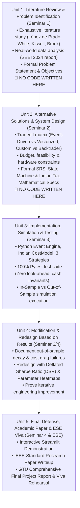

# Academic & Engineering Project Manager (GTU DI05000341)

This skill governs the end-to-end execution of engineering projects following academic university standards (specifically GTU Minor Project syllabus DI05000341). It ensures that no team rushes prematurely into coding without completing formal academic study, literature reviews, mathematical specifications, and architectural design contracts.

## The 5-Unit Phase Gating Framework

---

## Strict Rules of Engagement

1. **Gate 1 Approval**: Do not write single implementation code files until `docs/literature_review.md`, `docs/srs.md`, and `docs/mathematical_specifications.md` are completely drafted, reviewed, and cited.
2. **Deterministic Mathematical Formulas**: Every metric (Sharpe, DSR, Sortino, Drawdown) and every statutory fee (STT, GST, Stamp Duty, Exchange Turnover, Slippage) must have its exact LaTeX equation documented in the project specs before implementation.
3. **Traceability**: Every code function in Unit 3 must trace directly back to a functional requirement (FR) in the SRS from Unit 2.
4. **Unit 4 Redesign Rule**: The project MUST document what broke during testing and how the architecture was modified/redesigned to fix it (satisfying GTU Syllabus Unit 4 rubrics).
5. **Shared Task Pools**: Maintain transparent daily task pools for team members (Aayush & Meet) to ensure equal distribution of intellectual study, documentation, engineering, and viva preparation.
