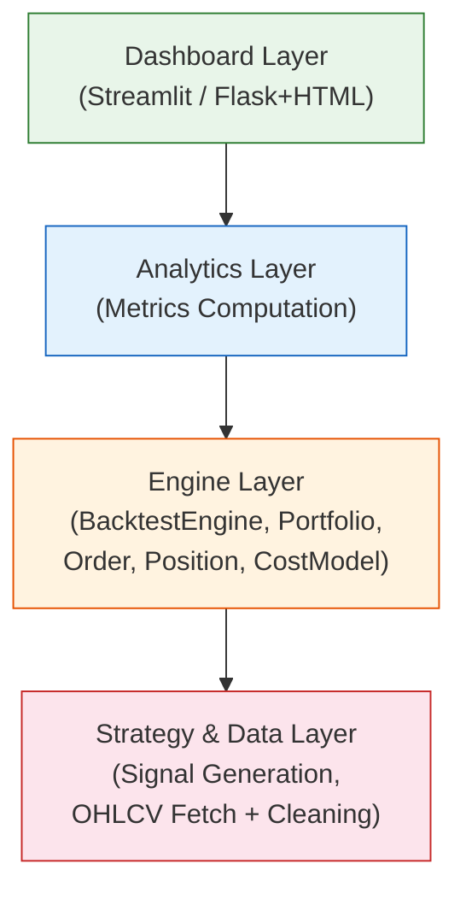
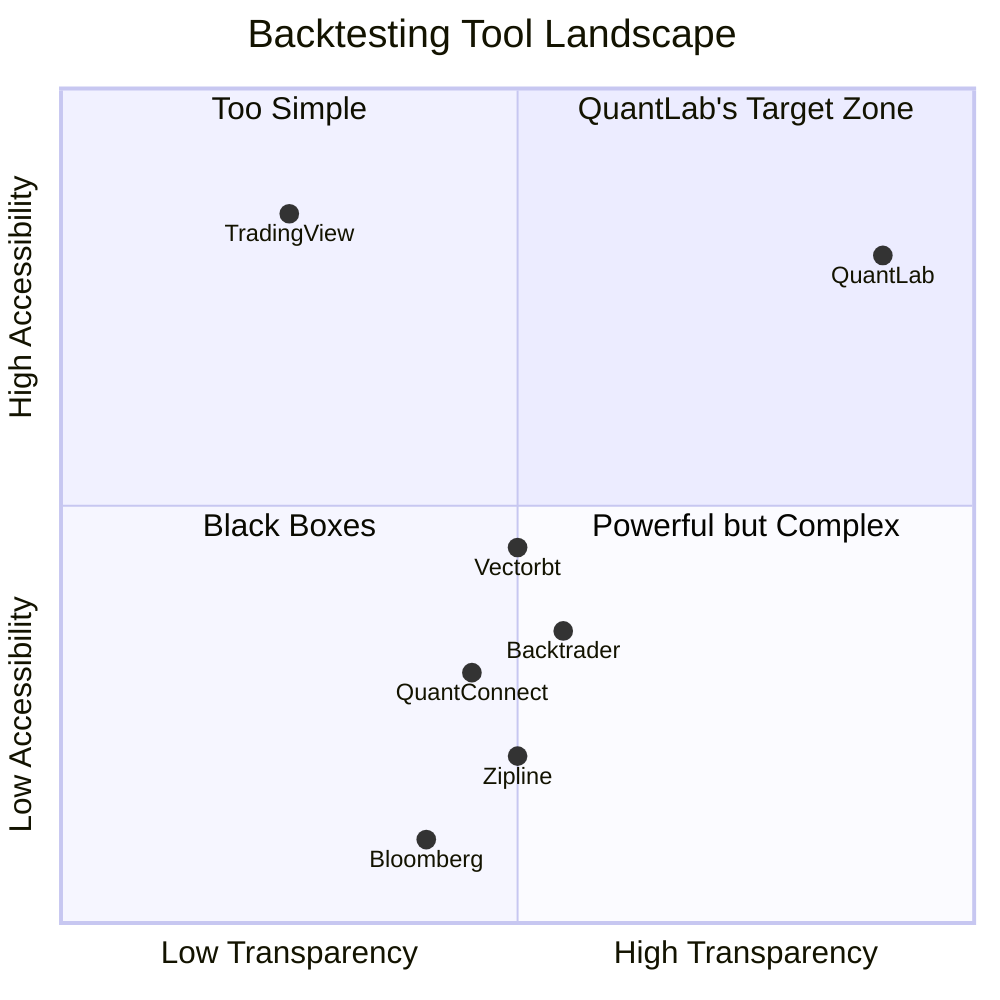

# QuantLab — Comprehensive Study & Analysis

**A Realistic Backtesting Engine for Algorithmic Trading Strategies**
GTU Diploma Engineering — Semester 5 Minor Project (DI05000341)

---

## Table of Contents

1. [What Is QuantLab?](#1-what-is-quantlab)
2. [The Research Problem](#2-the-research-problem)
3. [Academic & Theoretical Foundation](#3-academic--theoretical-foundation)
4. [System Architecture & Implementation Plan](#4-system-architecture--implementation-plan)
5. [What Makes QuantLab Novel?](#5-what-makes-quantlab-novel)
6. [Comparison with Existing Market Tools](#6-comparison-with-existing-market-tools)
7. [Strategies Implemented](#7-strategies-implemented)
8. [Key Metrics & Analytics](#8-key-metrics--analytics)
9. [Scope, Limitations & Honest Framing](#9-scope-limitations--honest-framing)
10. [Conclusion & Takeaways](#10-conclusion--takeaways)

---

## 1. What Is QuantLab?

QuantLab is a **from-scratch backtesting platform** built in Python that tests algorithmic trading strategies against real historical stock data under **realistic market conditions** — including transaction costs and slippage — and exposes how much of a strategy's apparent profitability is genuine versus illusory.

### Core Thesis

> Most backtested strategies look profitable. Most real-world deployed strategies lose money. QuantLab exists to quantify the gap between these two realities.

### What It Does (In Plain English)

```
Historical Stock Data → Trading Strategies → Simulated Execution (with costs) → Performance Analysis → Dashboard
```

A user picks a strategy (e.g., "buy when the 20-day average crosses above the 50-day average"), picks stocks and a date range, and QuantLab:
1. **Fetches** real OHLCV data (from Yahoo Finance / NSE)
2. **Generates** buy/sell signals based on the strategy's rules
3. **Simulates** executing those trades day-by-day, deducting realistic costs
4. **Splits** the data into tuning (in-sample) and validation (out-of-sample) periods
5. **Measures** performance: return, Sharpe ratio, max drawdown, win rate, CAGR
6. **Visualizes** everything in a comparative dashboard

---

## 2. The Research Problem

### 2.1 Why Backtesting Is Broken (The Three Silent Killers)

The project addresses three fundamental problems in strategy evaluation that are **well-documented in quantitative finance literature** but rarely addressed in student/retail-level tools:

#### Problem 1: Transaction Cost Blindness
| Scenario | Without Costs | With Realistic Costs |
|---|---|---|
| Strategy makes 500 trades/year | +18% annual return | +3% annual return |
| Strategy makes 50 trades/year | +12% annual return | +9% annual return |

Most naive backtests assume **zero-cost execution**. In reality, every trade incurs:
- **Brokerage/commission**: 0.01–0.5% per trade
- **Slippage**: the difference between the price you see and the price you get (especially on illiquid stocks)
- **Impact cost**: large orders can move the market against you

> [!IMPORTANT]
> A strategy that trades frequently can appear highly profitable in a zero-cost simulation while being a net loser in reality. QuantLab makes this visible by toggling costs on/off.

#### Problem 2: Overfitting / Data Snooping
If you test 100 parameter combinations on the same historical data and pick the best one, you haven't found a good strategy — you've found a strategy that happened to fit the noise in that specific dataset.

```
Example: SMA Crossover
- Tested: SMA(5,10), SMA(10,20), SMA(15,30), ..., SMA(50,200)
- Best performer on 2018-2022 data: SMA(12,37) → +24% annual return
- Same SMA(12,37) on 2023-2024 (unseen data): -8% annual return ← OVERFITTING EXPOSED
```

#### Problem 3: Look-Ahead Bias
A simulation that accidentally uses future information in its decisions. Example: using tomorrow's closing price to decide today's trade. This is **fatal** and surprisingly common in poorly-built backtesting code.

### 2.2 Research Questions QuantLab Answers

| # | Research Question |
|---|---|
| RQ1 | How much does including realistic transaction costs reduce a strategy's apparent profitability? |
| RQ2 | Does a strategy that looks good on in-sample data maintain its edge on unseen out-of-sample data? |
| RQ3 | Which strategy class (trend-following vs. mean-reversion vs. momentum) is most robust to cost friction and overfitting for Indian equities on daily bars? |
| RQ4 | How sensitive are results to parameter choices? (Are we picking a needle in a haystack, or is there a stable region?) |

---

## 3. Academic & Theoretical Foundation

### 3.1 Key Concepts from Quantitative Finance

#### Look-Ahead Bias
- **Definition**: Using information that wouldn't have been available at the time of the simulated decision
- **How QuantLab avoids it**: The event-driven engine processes data strictly chronologically. On day *t*, only data from days ≤ *t* is accessible. No future data leaks into signal generation.
- **Key reference**: Bailey, Borwein, López de Prado, Zhu (2014) — *"Pseudo-Mathematics and Financial Charlatanism"*

#### Overfitting / Data Snooping Bias
- **Definition**: Fitting a model to noise rather than signal by over-optimizing on historical data
- **How QuantLab exposes it**: Mandatory in-sample/out-of-sample split. Parameters are tuned ONLY on in-sample data; validation happens on out-of-sample data that was never seen during tuning.
- **Key reference**: Bailey & López de Prado (2012) — *"The Sharpe Ratio Efficient Frontier"*; White (2000) — *"A Reality Check for Data Snooping"*

#### Survivorship Bias
- **Definition**: Only testing on stocks that currently exist (survivors), ignoring companies that went bankrupt or were delisted
- **How QuantLab handles it**: Explicitly documented as a known limitation — the stock universe is fixed and includes only currently-tradeable stocks. This is honestly disclosed rather than hidden.
- **Key reference**: Brown, Goetzmann, Ibbotson, Ross (1992) — *"Survivorship Bias in Performance Studies"*

#### Transaction Cost Modeling
- **Definition**: Modeling the real-world frictions of executing trades
- **How QuantLab implements it**: Configurable `CostModel` with percentage-based transaction costs and slippage applied to every simulated trade
- **Key reference**: Kissell & Glantz (2003) — *"Optimal Trading Strategies"*

### 3.2 The Sharpe Ratio and Its Limitations

QuantLab computes the Sharpe ratio as a primary metric, but the project documentation (and viva prep) explicitly acknowledges what it **doesn't** capture:

$$\text{Sharpe Ratio} = \frac{R_p - R_f}{\sigma_p}$$

| What Sharpe Captures | What Sharpe Misses |
|---|---|
| Risk-adjusted return | Tail risk (extreme losses) |
| Volatility penalization | Skewness of returns |
| Comparability across strategies | Non-normal return distributions |

> [!NOTE]
> This honest framing of metric limitations is itself a research contribution at the diploma level — most student projects present the Sharpe ratio as an unqualified "goodness score."

### 3.3 The Efficient Market Hypothesis Connection

QuantLab's strategies implicitly test weak-form market efficiency:
- **If markets are weak-form efficient**: technical strategies (SMA, RSI, momentum) should NOT produce consistent excess returns after costs
- **QuantLab's expected finding**: most strategies will show degraded performance after costs and on out-of-sample data, which is consistent with EMH and actually strengthens the project's credibility

---

## 4. System Architecture & Implementation Plan

### 4.1 Four-Layer Architecture



> [!TIP]
> The deliberate decoupling is a key design decision: each layer can be **tested independently**. The Strategy layer doesn't know about the engine; the engine doesn't know about the dashboard.

### 4.2 Core Engine Design (Event-Driven)

The engine uses an **event-driven simulation loop**, not a vectorized approach. This is a deliberate choice:

| Event-Driven (QuantLab's choice) | Vectorized (Simpler alternative) |
|---|---|
| Processes day-by-day, like real trading | Applies signals to entire arrays at once |
| Naturally prevents look-ahead bias | Easier to accidentally use future data |
| Supports realistic order filling logic | Hard to model partial fills, position limits |
| Slower but more realistic | Faster but less realistic |
| Closer to real trading systems | Better for quick research |

### 4.3 Implementation Plan (Phase-Based)

```mermaid
gantt
    title QuantLab Development Phases
    dateFormat X
    axisFormat %s
    
    section Phase 1 - Foundation
    Literature study & bias research    :a1, 0, 1
    Finalize strategies & stock universe :a2, 0, 1
    Design engine architecture          :a3, 0, 1
    Setup repo & pytest skeleton        :a4, 0, 1
    
    section Phase 2 - Core Build
    Implement 3 strategy signals        :b1, 1, 2
    Build backtest engine core          :b2, 1, 2
    Add cost model                      :b3, 1, 2
    Unit tests                          :b4, 1, 2
    
    section Phase 3 - Full Experiments
    Run all strategies through engine   :c1, 2, 3
    In-sample/out-of-sample split       :c2, 2, 3
    Compute all metrics                 :c3, 2, 3
    Build comparison dashboard          :c4, 2, 3
    
    section Phase 4 - Analysis & Defense
    Analyze degradation patterns        :d1, 3, 4
    Write final report                  :d2, 3, 4
    Viva preparation                    :d3, 3, 4
```



### 4.4 Key Classes

| Class | Responsibility |
|---|---|
| `Order` | Represents a buy/sell order with symbol, side, quantity, price, timestamp |
| `Position` | Tracks holdings in a single stock: quantity, average entry price, unrealized PnL |
| `Portfolio` | Manages cash + all positions; applies orders through the cost model; tracks equity curve over time |
| `CostModel` | Applies transaction cost % and slippage % to every executed order |
| `BacktestEngine` | The core loop: for each day, get signals → create orders → apply costs → update portfolio |
| `Strategy` (interface) | Common interface for all strategies: `generate_signals(price_data, params) → signal_series` |

### 4.5 Tech Stack

| Component | Technology | Why |
|---|---|---|
| Language | Python 3.x | Industry standard for quant finance; rich ecosystem |
| Data | yfinance / NSE CSV | Free, no API key required |
| Computation | pandas, NumPy | Vectorized data operations |
| Visualization | Matplotlib / Plotly | Interactive charts |
| Dashboard | Streamlit | Rapid prototyping, non-technical user friendly |
| Testing | pytest | Standard Python testing framework |
| Data format | OHLCV CSV/DataFrame | Universal financial data format |

---

## 5. What Makes QuantLab Novel?

> [!IMPORTANT]
> QuantLab is a **diploma-level project**, not a PhD thesis. Its novelty should be understood in that context. The following are genuinely differentiating aspects compared to what students typically produce.

### 5.1 Novelty Matrix

| Aspect | Typical Student Project | QuantLab |
|---|---|---|
| **Cost modeling** | Ignores transaction costs entirely | Configurable costs + slippage with toggle to see impact |
| **Overfitting awareness** | Tests on all data, reports best result | Explicit in-sample/out-of-sample split |
| **Look-ahead bias** | Often present unknowingly | Event-driven engine structurally prevents it |
| **Metric honesty** | "Strategy returns 50%!" | "Strategy returns 50% in-sample, 8% out-of-sample, 2% after costs" |
| **Engine origin** | Uses backtrader/zipline as black box | Built from scratch — every line is explainable |
| **Transparency** | Metrics are black-box numbers | Every metric formula is documented and traceable |
| **Reproducibility** | "I ran it and it worked" | Experiment log with run_id, parameters, settings, results |
| **Limitations disclosure** | Not mentioned | Explicitly listed (no tick data, no market impact, survivorship bias acknowledged) |

### 5.2 The Core Novelty in One Sentence

> QuantLab's novelty is not in the strategies or the engine — it's in the **systematic, transparent exposure of the gap between apparent and real strategy performance**, built from first principles rather than wrapped around a black-box library.

### 5.3 Educational Novelty

The project is itself a **teaching tool**:
- A user can see exactly how much transaction costs erode returns
- A user can see exactly how much a strategy degrades out-of-sample
- A user can change parameters and see if they're overfitting or finding a robust signal
- Everything is traceable — no hidden magic

---

## 6. Comparison with Existing Market Tools

### 6.1 Open-Source Backtesting Frameworks

| Tool | Engine Type | Cost Model | In/Out-of-Sample | Overfitting Detection | Target User | Complexity | Status |
|---|---|---|---|---|---|---|---|
| **Backtrader** | Event-driven | ✅ Yes | ❌ Manual only | ❌ No | Intermediate Python devs | High | Maintained |
| **Zipline** | Event-driven | ✅ Yes | ❌ Manual only | ❌ No | Quant researchers | Very High | Archived (unmaintained) |
| **QuantConnect (Lean)** | Event-driven | ✅ Yes | ❌ Manual only | ❌ No | Professional quants | Very High | Active |
| **Vectorbt** | Vectorized | ✅ Basic | ❌ Manual only | ❌ No | Data scientists | Medium | Active |
| **bt** (pmorissette) | Vectorized | ✅ Basic | ❌ Manual only | ❌ No | Portfolio analysts | Medium | Active |
| **PyAlgoTrade** | Event-driven | ✅ Yes | ❌ No | ❌ No | Beginners | Low-Medium | Stale |
| **Freqtrade** | Event-driven | ✅ Yes | ❌ Manual only | ❌ No | Crypto traders | High | Active |
| **Jesse** | Event-driven | ✅ Yes | ❌ No | ❌ No | Crypto traders | Medium | Active |
| **QuantLab** | Event-driven | ✅ Yes (toggle) | ✅ Built-in | ✅ Explicit (via IS/OOS) | Students/Learners | **Low** | New |

### 6.2 Commercial/Paid Platforms

| Platform | Cost Model | IS/OOS Split | Overfitting Guard | Price | Target |
|---|---|---|---|---|---|
| **TradingView** (Pine Script) | ✅ Commission only | ❌ No | ❌ No | Free-$60/mo | Retail traders |
| **MetaTrader** (MQL4/5) | ✅ Yes | ✅ Walk-forward optimizer | ⚠️ Partial | Free (broker-provided) | Forex/CFD traders |
| **Amibroker** | ✅ Yes | ✅ Walk-forward | ⚠️ Partial | $279 one-time | Technical traders |
| **Bloomberg Terminal** | ✅ Full | ✅ Yes | ⚠️ Partial | ~$24,000/yr | Institutional |
| **QuantConnect Cloud** | ✅ Full | ❌ Manual | ❌ No | Free-$60/mo | Quant developers |

### 6.3 Where QuantLab Fills a Gap



| Gap in Market | How QuantLab Addresses It |
|---|---|
| **No tool makes cost impact visually obvious** | Cost toggle: run with/without costs, see the delta on a chart |
| **No tool has built-in overfitting education** | In-sample vs. out-of-sample comparison is a first-class feature, not an afterthought |
| **Professional tools are opaque** | QuantLab's engine is ~500 lines of readable Python — every calculation is traceable |
| **Professional tools have steep learning curves** | Streamlit dashboard: click-and-compare, no coding needed |
| **Student tools use black-box libraries** | Built from scratch — every `Order`, `Position`, `Portfolio` is hand-coded |

### 6.4 Honest Assessment: Where QuantLab Falls Short

> [!CAUTION]
> QuantLab is NOT a replacement for professional tools. It is intentionally limited:

| Capability | Professional Tools | QuantLab |
|---|---|---|
| Asset classes | Equities, FX, Crypto, Options, Futures | Equities only |
| Data granularity | Tick, second, minute, daily | Daily only |
| Order types | Market, limit, stop, OCO, bracket | Market orders only |
| Market impact | Modeled | Not modeled |
| Live trading | Yes | No |
| Number of strategies | Unlimited | 3 |
| Walk-forward optimization | Yes | Manual IS/OOS split |
| Monte Carlo simulation | Some | No |

---

## 7. Strategies Implemented

### 7.1 Strategy 1: SMA Crossover (Trend-Following)

**Logic**: Buy when the short-term Simple Moving Average crosses above the long-term SMA; sell when it crosses below.

```
Signal = BUY   when SMA(short) crosses above SMA(long)
Signal = SELL  when SMA(short) crosses below SMA(long)
Signal = HOLD  otherwise
```

**Parameters**: `short_window` (default: 20), `long_window` (default: 50)

**Academic basis**: One of the most studied technical indicators. Brock, Lakonishok & LeBaron (1992) — *"Simple Technical Trading Rules and the Stochastic Properties of Stock Returns"*

**Strengths**: Simple, captures trends
**Weaknesses**: Whipsaws in sideways markets; lagging indicator

### 7.2 Strategy 2: RSI Mean Reversion

**Logic**: Buy when RSI drops below an oversold threshold (price is "too low"); sell when RSI rises above an overbought threshold.

```
Signal = BUY   when RSI(period) < oversold_threshold
Signal = SELL  when RSI(period) > overbought_threshold
Signal = HOLD  otherwise
```

**Parameters**: `rsi_period` (default: 14), `oversold` (default: 30), `overbought` (default: 70)

**Academic basis**: Wilder (1978) — *"New Concepts in Technical Trading Systems"*. Mean reversion is extensively studied; Poterba & Summers (1988) showed evidence of it in stock returns.

**Strengths**: Profits from overreaction; works in range-bound markets
**Weaknesses**: Fails in strong trends (buys into a falling knife)

### 7.3 Strategy 3: Momentum

**Logic**: Buy stocks that have risen over a lookback period (winners keep winning); sell/avoid those that have fallen.

```
Signal = BUY   when return over lookback_period > 0
Signal = SELL  when return over lookback_period < 0
Signal = HOLD  otherwise
```

**Parameters**: `lookback_period` (default: 60 days)

**Academic basis**: Jegadeesh & Titman (1993) — *"Returns to Buying Winners and Selling Losers"*. Momentum is one of the most robust anomalies in finance.

**Strengths**: Well-documented anomaly; strong academic support
**Weaknesses**: Momentum crashes (sudden reversals); high turnover = high cost friction

### 7.4 Strategy Comparison Framework

| Dimension | SMA Crossover | RSI Mean Reversion | Momentum |
|---|---|---|---|
| Philosophy | Trend-following | Counter-trend | Trend-following |
| Trade frequency | Medium | Low-Medium | Medium-High |
| Cost sensitivity | Medium | Low | **High** |
| Works best in | Trending markets | Range-bound markets | Persistent trends |
| Overfitting risk | Low (few params) | Medium (3 params) | Low (1 param) |

---

## 8. Key Metrics & Analytics

### 8.1 Metrics Computed

| Metric | Formula / Definition | What It Tells You |
|---|---|---|
| **Total Return** | (Final Value - Initial Value) / Initial Value | Overall profitability |
| **CAGR** | (Final/Initial)^(1/years) - 1 | Annualized growth rate |
| **Sharpe Ratio** | (Mean excess return) / (Std dev of returns) | Risk-adjusted performance |
| **Max Drawdown** | Largest peak-to-trough decline in portfolio value | Worst-case loss scenario |
| **Win Rate** | Winning trades / Total trades | Batting average |

### 8.2 The Experiment Matrix

QuantLab runs a full factorial experiment:

```
3 Strategies × 2 Cost Settings × 2 Sample Periods = 12 experiment runs
     │              │                    │
     ├─ SMA         ├─ Costs ON          ├─ In-sample
     ├─ RSI         └─ Costs OFF         └─ Out-of-sample
     └─ Momentum
```

This produces a **12-cell comparison table** that directly answers the research questions:
- Compare row-by-row: which strategy is best?
- Compare costs ON vs OFF: how much do costs erode returns?
- Compare IS vs OOS: is the strategy overfitting?

### 8.3 Dashboard Visualizations

| Chart | Purpose |
|---|---|
| **Equity Curve** | Shows portfolio value over time for each strategy |
| **Drawdown Chart** | Shows peak-to-trough declines over time |
| **Comparison Table** | Side-by-side metrics for all strategies |
| **Cost Impact View** | Same strategy with/without costs overlaid |

---

## 9. Scope, Limitations & Honest Framing

### 9.1 What's In Scope

- 3 rule-based strategies on Indian equities
- Daily-bar resolution backtesting
- Transaction cost and slippage modeling
- In-sample/out-of-sample validation
- Comparative dashboard
- Experiment logging for reproducibility

### 9.2 What's Explicitly Out of Scope (and Why)

| Limitation | Reason It's Acceptable |
|---|---|
| No live/paper trading | Backtesting is the research focus; live trading adds operational complexity without academic value |
| No tick/intraday data | Free data sources provide daily bars only; intraday adds complexity without changing the core research questions |
| No market impact modeling | At the order sizes a retail user would trade, market impact is negligible |
| No partial order fills | Simplification that doesn't materially affect daily-bar results |
| Equities only | Single-asset focus allows depth over breadth |
| Survivorship bias present | Honestly acknowledged; mitigation would require expensive historical databases |

> [!TIP]
> **Viva strategy**: Listing limitations STRENGTHENS the project. It shows the team understands the problem space deeply and has made deliberate, defensible engineering tradeoffs.

### 9.3 Why Build From Scratch Instead of Using Backtrader/Zipline?

This is a critical question for the viva. The answer:

1. **Defensibility**: The team can explain every line of the engine. With backtrader, "how does order filling work?" would be answered with "I don't know, the library handles it."
2. **Transparency**: The project's thesis is about *exposing hidden assumptions*. Using a black-box library would undermine that thesis.
3. **Learning**: The syllabus (DI05000341) requires implementation, testing, and modification — which requires owning the code.
4. **Scope fit**: Backtrader has 15,000+ lines of code. QuantLab's engine is ~500 lines. The latter is appropriate for a diploma project.

---

## 10. Conclusion & Takeaways

### 10.1 What QuantLab Contributes

| Contribution Type | Description |
|---|---|
| **Engineering** | A clean, modular, from-scratch backtesting engine with cost modeling |
| **Research** | Systematic comparison of 3 strategy classes under realistic conditions |
| **Educational** | A transparent tool that teaches users about overfitting, costs, and bias |
| **Methodological** | Experiment logging for reproducibility; honest limitation disclosure |

### 10.2 Expected Findings (Based on Literature)

Based on decades of academic research, QuantLab is likely to find:

1. **Transaction costs significantly reduce returns** — especially for high-frequency strategies (momentum)
2. **Out-of-sample performance degrades** — evidence of overfitting when parameters are tuned on in-sample data
3. **Simple strategies (fewer parameters) are more robust** — less prone to overfitting
4. **No strategy consistently beats buy-and-hold after costs** — consistent with weak-form market efficiency

> [!NOTE]
> These "negative" findings are actually the **strongest possible result** for the project. They demonstrate that the tool works correctly and that the team understands the domain.

### 10.3 Key References

| Reference | Relevance |
|---|---|
| Bailey & López de Prado (2014) — *"Pseudo-Mathematics and Financial Charlatanism"* | Overfitting in backtesting |
| Brock, Lakonishok & LeBaron (1992) | SMA crossover as a technical signal |
| Jegadeesh & Titman (1993) | Momentum anomaly |
| Wilder (1978) | RSI indicator |
| White (2000) — *"A Reality Check for Data Snooping"* | Statistical testing for strategy validity |
| Kissell & Glantz (2003) | Transaction cost modeling |
| Brown et al. (1992) | Survivorship bias |
| Poterba & Summers (1988) | Mean reversion in stock returns |

---

*This study covers the complete landscape of the QuantLab project: the problem it solves, the research foundation, the implementation plan, what's novel, how it compares to existing tools, and what findings to expect. The project is well-scoped for a diploma-level submission and demonstrates genuine understanding of quantitative finance concepts.*
