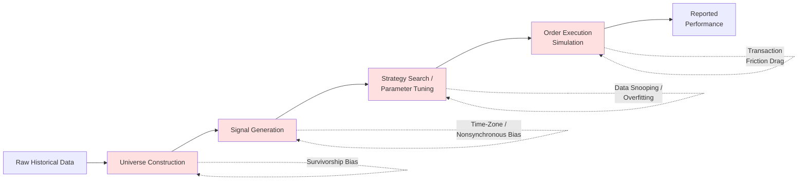
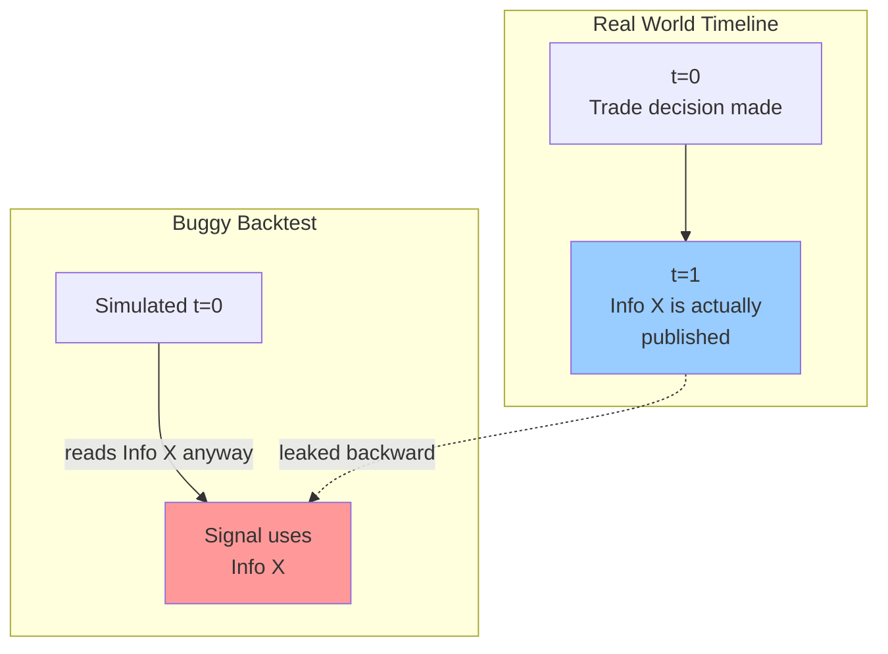
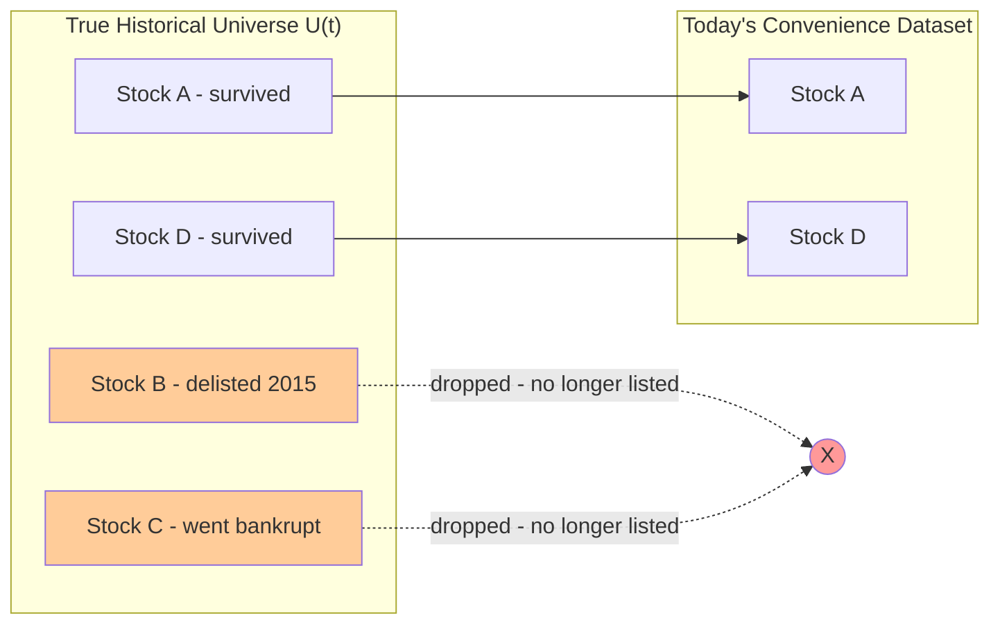
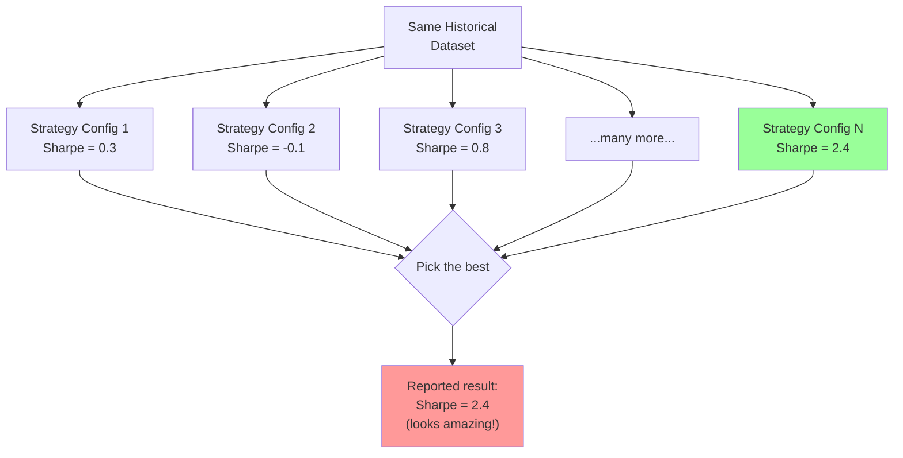
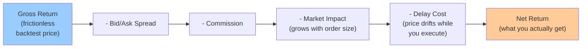
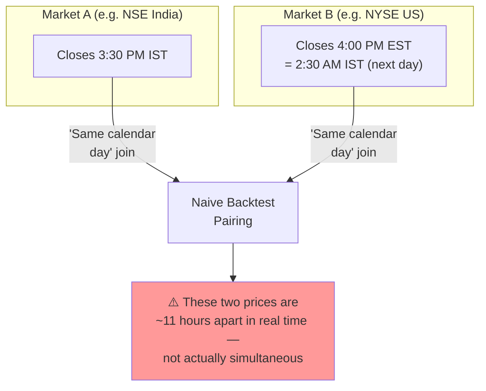

--- done byc meet manual ---

# Literature Survey: Backtest Biases and Execution Frictions in Quantitative Trading

When evaluating quantitative trading strategies historically, the performance decay between backtested simulations and live production typically stems from four distinct structural errors: temporal information leakage, multiplicity of statistical tests, selective universe truncation, and frictionless market execution assumptions.

---

## 1. Look-Ahead Bias

Look-ahead bias is fundamentally an information filtration violation where an algorithm at simulated time $t$ has access to information not present in the historical market state at that instant. As formalized by Bailey, Borwein, López de Prado, and Zhu (2014) (*Pseudo-mathematics and financial charlatanism*, *Notices of the AMS*), conditioning execution logic on unreleased or revised data invalidates backtest realism.

Formally, let the true market filtration at time $t$ be defined by all events occurring and publicly released at or before $t$:

$$\mathcal{F}_t^{\text{market}} = \sigma \left( \{X_s : s \le t, \, \tau_{\text{pub}}(X_s) \le t\} \right)$$

where $\tau_{\text{pub}}(X_s)$ represents the exact publication timestamp of data point $X_s$. Look-ahead bias occurs when the strategy's operational filtration $\mathcal{F}_t^{\text{strategy}}$ strictly contains future elements:

$$\exists \, x \in \mathcal{F}_t^{\text{strategy}} \quad \text{such that} \quad x \notin \mathcal{F}_t^{\text{market}}$$

If a signal $S_t = g(I_t(P_{t+h}))$ incorporates corporate accounting revisions or future macro prints ($h > 0$), the expected return estimation error $\Delta \mu$ is strictly positive:

$$\Delta \mu = \mathbb{E}\left[ S_t R_{t+1} \mid \mathcal{F}_{t+h} \right] - \mathbb{E}\left[ S_t R_{t+1} \mid \mathcal{F}_t \right] > 0$$

This inflates the apparent sample Sharpe ratio $\widehat{\text{SR}}$ and suppresses realistic historical drawdowns:

$$\widehat{\text{SR}}_{\text{biased}} = \frac{\mathbb{E}[R_t] + \Delta \mu - R_f}{\sqrt{\operatorname{Var}(R_t - \epsilon_t)}} \gg \text{SR}_{\text{true}}$$

**Mitigation in QuantLab:**
* Implement an immutable bi-temporal data layer storing every record with dual timestamps: event effective time ($t_{\text{eff}}$) and public availability time ($t_{\text{pub}}$).
* Restrict data feed access at runtime such that query results satisfy $t_{\text{pub}} \le t_{\text{sim}}$.
* Enforce an execution latency invariant banning same-bar fills on signal-generating close prices: $t_{\text{fill}} \ge t_{\text{bar\_close}} + \delta_{\text{latency}}$.

---

## 2. Data Snooping & Overfitting

Data snooping occurs when a fixed historical sample is reused across repeated iterations to optimize parameter sets or trading rules. Halbert White (2000) (*A Reality Check for Data Snooping*, *Econometrica*) proved that evaluating the best-performing rule without adjusting for the total search space creates false-positive alpha.

Let $f_k(Z_t)$ denote the excess return of strategy candidate $k \in \{1, \dots, K\}$ relative to a benchmark. The family-wise null hypothesis states that no model possesses genuine predictive superiority:

$$H_0: \max_{k=1,\dots,K} \mathbb{E}[f_k(Z)] \le 0$$

Evaluating the maximum sample performance statistic:

$$\bar{V}_K = \max_{k=1,\dots,K} \left( \frac{1}{\sqrt{T}} \sum_{t=1}^T f_k(Z_t) \right)$$

Under $H_0$, assuming independent standard normal test statistics $Z_k \sim \mathcal{N}(0, 1)$, the expected value of the sample maximum scales asymptotically with the search space $K$:

$$\mathbb{E}\left[ \max_{1 \le k \le K} Z_k \right] \approx \sqrt{2 \ln K} - \frac{\ln(\ln K) + \ln(4\pi)}{2\sqrt{2 \ln K}}$$

Selecting the highest Sharpe ratio out of thousands of trial configurations without multiplicity corrections causes the Type I error rate to approach 1:

$$\lim_{K \to \infty} P\left(\max_{1 \le k \le K} \widehat{\text{SR}}_k > c_\alpha \mid H_0\right) = 1$$

**Mitigation in QuantLab:**
* Maintain an internal audit ledger that automatically logs every backtest run, parameter sweep, and trial count $K$.
* Compute and report the Deflated Sharpe Ratio (DSR), which discounts in-sample Sharpe ratio estimates based on trial count $K$, sample variance of trials, skewness ($\hat{\gamma}_3$), and kurtosis ($\hat{\gamma}_4$):

$$\text{DSR} = \Phi \left( \frac{(\widehat{\text{SR}} - \text{SR}^*) \sqrt{T-1}}{\sqrt{1 - \hat{\gamma}_3 \widehat{\text{SR}} + \frac{\hat{\gamma}_4 - 1}{4}\widehat{\text{SR}}^2}} \right)$$

$$\text{where} \quad \text{SR}^* = \sqrt{2 \ln K} \left(1 - \frac{\gamma}{\ln K}\right) + \frac{\ln(\ln K)}{2\sqrt{2 \ln K}}$$

---

## 3. Survivorship Bias

Survivorship bias distorts backtests by restricting the historical asset universe to entities that remain active at the end of the sample horizon $T_{\text{end}}$. Brown, Goetzmann, Ibbotson, and Ross (1992) (*Survivorship Bias in Performance Studies*, *Review of Financial Studies*) demonstrated that conditioning on survival introduces a spurious correlation between volatility and apparent performance.

Let $R_{i,t}$ be the return of asset $i$ at time $t$, and let $S_{i,t} \in \{0, 1\}$ be an indicator denoting survival through period $t$. The survival probability is monotonically related to cumulative historical returns:

$$P(S_{i,t} = 1 \mid R_{i,1}, \dots, R_{i,t}) = f\left(\sum_{s=1}^t R_{i,s}\right), \quad f' > 0$$

Conditioning the sample on survival up to $T_{\text{end}}$ biases the cross-sectional mean return upward:

$$\mathbb{E}\left[ R_{i,t} \mid S_{i,T_{\text{end}}} = 1 \right] = \mu_i + \operatorname{Cov}\left(R_{i,t}, S_{i,T_{\text{end}}}\right) \cdot \frac{1}{P(S_{i,T_{\text{end}}} = 1)}$$

Because failing, bankrupt, or acquired firms have negative covariance with the survival indicator, truncating them removes the left tail of the return distribution, overstating historical mean returns ($\mu$) and understating historical downside risk ($\sigma$).

**Mitigation in QuantLab:**
* Construct dynamic, point-in-time universe definitions $\mathcal{U}(t) = \{i \mid t_{\text{listing}}(i) \le t \le t_{\text{delisting}}(i)\}$ evaluated per simulation step.
* Implement explicit delisting handlers: liquidating bankrupt assets at statutory recovery rates or terminal price $0.00$ on $t_{\text{delist}}$, and converting acquired assets into cash or parent equity per corporate filing terms.

---

## 4. Transaction Friction & Market Impact Drag

Frictionless backtests assume infinite liquidity at quoted mid-prices. Kissell and Glantz (2003) (*Optimal Trading Strategies*, *Amacom/McGraw-Hill*) model realistic execution drag using Implementation Shortfall, accounting for fees, spread crossing, delay costs, and dynamic market impact.

When executing an order of size $Q$ relative to Average Daily Volume ($ADV$), transaction costs scale non-linearly with volume and volatility $\sigma$:

$$\text{Cost}_{\text{total}}(Q) = \underbrace{c_{\text{fixed}} \cdot Q}_{\text{Commissions/Fees}} + \underbrace{\frac{1}{2} S_{\text{spread}} \cdot Q}_{\text{Spread Traversal}} + \underbrace{a_1 \cdot \sigma \cdot Q \left(\frac{Q}{ADV}\right)^{0.5}}_{\text{Temporary Impact}} + \underbrace{a_2 \cdot \sigma \cdot Q \left(\frac{Q}{ADV}\right)}_{\text{Permanent Impact}}$$

Where $S_{\text{spread}}$ is the prevailing bid-ask spread and the square-root term reflects temporary liquidity displacement. Assuming zero cost causes net strategy returns $\text{SR}_{\text{net}}$ to degrade rapidly under turnover $\tau_{\text{turnover}}$:

$$\text{SR}_{\text{net}} = \frac{\mu_{\text{gross}} - \tau_{\text{turnover}} \cdot \mathbb{E}\left[\text{Cost}_{\text{total}}(Q)\right] - R_f}{\sigma_{\text{portfolio}}}$$

**Mitigation in QuantLab:**
* Dynamic execution price simulation parameterized per trade:

$$P_{\text{fill}} = P_{\text{mid}} \pm \left[ \frac{S_{\text{spread}}}{2} + \eta \cdot \sigma_t \cdot \left( \frac{V_{\text{order}}}{V_{\text{bar}}} \right)^{0.5} \right]$$

* Strategy capacity analysis: sweep asset allocations over capital scaling parameters to identify the capacity limit where net alpha decays below the hurdle rate:

$$\text{Capacity} = \arg\max_C \left\{ C \mid \text{SR}_{\text{net}}(C) \ge \text{SR}_{\text{hurdle}} \right\}$$

--- Summery with using Claude ---
# Task 1 (D1-1) — Backtest Biases: Visual Concept Guide

A simplified, diagram-first companion to `literature_review.md` and `backtest_biases_and_friction.md`. Each diagram shows the *mechanism* — how the bias sneaks into a backtest — not just the definition.

---

## 1. The Big Picture: Where Each Bias Enters the Pipeline

**Reading this diagram:** every stage of a backtest is a place a bias can quietly inflate results. Fix each stage independently — a strategy can be look-ahead-clean and still be overfit, or overfit-clean and still ignore transaction costs.

---

## 2. Look-Ahead Bias — "Using tomorrow's newspaper today"

**Rule:** a data point should only be visible to the simulation at or after its true publication timestamp — never before.

$$\hat{\mathcal{F}}_t \subseteq \mathcal{F}_t \quad \text{(what the backtest knows)} \subseteq \text{(what was actually knowable)}$$

**Common trap:** a database silently stores the *revised* (final) value of an economic/earnings figure under its *original* date — the backtest thinks it's using "old" data, but it's actually using information from the future.

---

## 3. Survivorship Bias — "Only interviewing the winners"

**Rule:** the backtest universe at each historical date must reflect what was *actually tradable on that date* — including names that later failed — not just what still exists today.

**Effect:** removing the failures removes the worst outcomes → inflated average return, understated risk/drawdown.

---

## 4. Data Snooping & Overfitting — "Trying enough darts until one hits the bullseye"

**The catch:** with enough random tries, *something* will look great by chance alone — even on pure noise. The reported 2.4 is not a fair estimate of what config $N$ will do out-of-sample; it's the maximum of $N$ draws.

$$\text{Correct question: } P\Big(\max_{i=1,\dots,N}\widehat{SR}_i \ge c \;\Big|\; \text{no real skill}\Big) \quad \ne \quad P(\widehat{SR} \ge c)$$

**Fix:** track $N$ (how many configs were tried), and discount the winning Sharpe ratio accordingly (Deflated Sharpe Ratio).

---

## 5. Transaction Friction Drag — "The gap between the backtest and the real fill"

**Rule of thumb:** friction scales with **how much and how often** you trade. A low-turnover strategy barely notices it; a high-turnover strategy's entire "edge" can be friction-cost illusion.

$$D_t = c_{\text{spread}} + c_{\text{commission}} + c_{\text{impact}}(Q_t) + c_{\text{delay}}(\Delta t)$$

---

## 6. Time-Zone / Nonsynchronous Bias — "Comparing a photo taken at noon to one taken at midnight"

**Rule:** "same date" ≠ "same moment." Cross-market signals need an explicit, honest time lag — not a calendar-date shortcut.

---

## 7. One-Page Cheat Sheet

| Bias | Bad habit it punishes | One-line fix |
|---|---|---|
| Look-Ahead | Using info before it existed | Timestamp everything by *publication* time, gate the simulation clock on it |
| Survivorship | Testing only on today's survivors | Rebuild the universe as it truly was, on every historical date |
| Data Snooping / Overfitting | Picking the best of many tries and reporting it as "the" result | Count your trials; discount the winner's Sharpe ratio accordingly |
| Transaction Friction | Assuming free, instant, unlimited-size trading | Model spread + commission + size-dependent impact + delay explicitly |
| Time-Zone / Nonsynchronous | Treating "same date" as "same moment" | Use explicit real-time lags across markets, not calendar-date joins |

---

------ Complete Task 1 summery by manual -------

