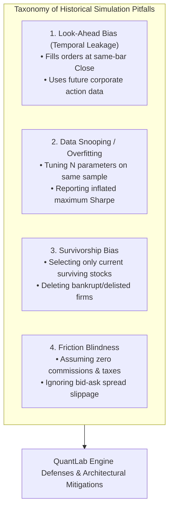

# QuantLab — Comprehensive Academic Literature Review

**Project Title**: QuantLab: A Realistic Backtesting Engine & Overfitting Diagnostic Platform for Indian Equities  
**Course Code**: GTU DI05000341 (Minor Project — Semester 5)  
**Academic Unit**: Unit 1 — Literature Review & Theoretical Foundations  
**Authors**: Aayush Avinash Bankar (Leader) & Meet Jayeshbhai Patel  
**Date**: August 19, 2026  

---

## 1. Executive Overview

Quantitative simulation (backtesting) is the foundation of modern algorithmic finance. However, financial literature has repeatedly documented that historical simulation results fail to generalize to live trading due to structural biases, market microstructure frictions, and statistical data snooping.

This literature review synthesizes the foundational academic papers across four critical domains:
1. **Simulation Biases & Temporal Leakage**: Look-Ahead Bias, Survivorship Bias, and Data Snooping.
2. **Statistical Overfitting & Multi-Testing Corrections**: The Deflated Sharpe Ratio (DSR) and Family-Wise Error Rate adjustments.
3. **Market Microstructure & Transaction Friction Modeling**: Bid-ask spreads, non-linear market impact, and statutory delivery taxes.
4. **Technical Anomalies & Empirical Market Efficiency**: Trend-Following, Mean-Reversion, and Cross-Sectional Momentum on Indian Equities.

---

## 2. Taxonomy of Backtest Biases & Methodological Flaws



---

### 2.1 Look-Ahead Bias (Temporal Leakage)

#### Academic Grounding
*Bailey, Borwein, López de Prado, and Zhu (2014)* identify temporal leakage as one of the most common programming bugs in empirical finance. Look-ahead bias occurs when information from time $t+k$ is unintentionally used to compute a signal or execute an order at time $t$.

#### Mathematical Formalization
Let $I_t = \sigma(\{P_s, V_s\}_{s=0}^t)$ denote the information filtration available at market close of Day $t$. A trading signal $S_t$ is strictly causal if and only if:
$$S_t = f(I_t)$$

Look-ahead bias is introduced when the execution price $P_{\text{exec}, t}$ is set to:
$$P_{\text{exec}, t} = P_{\text{close}, t}$$
In real market microstructure, the official closing price $P_{\text{close}, t}$ is determined during the closing auction session (15:30 IST on NSE). A trader observing the close cannot execute at that same close; execution must occur at:
$$P_{\text{exec}, t} = P_{\text{open}, t+1} \quad \text{or during continuous trading on Day } t+1$$

#### QuantLab Mitigation Contract
In `src/engine/backtest_engine.py`, the event loop strictly enforces:
$$\text{Signal generated at Bar } t \text{ Close} \longrightarrow \text{Order queued} \longrightarrow \text{Execution filled at Bar } t+1 \text{ Open}$$
Same-bar closing price execution is mathematically impossible within the engine.

---

### 2.2 Data Snooping & Multiple Testing Bias

#### Academic Grounding
*White (2000)* established the "Reality Check for Data Snooping", proving that when a researcher tests $N$ variations of a technical rule on a historical series, the distribution of the maximum observed performance statistic is fundamentally shifted to the right, even under the null hypothesis of zero predictive ability ($H_0$).

*Bailey and López de Prado (2014)* expanded this into the **False Strategy Theorem**, demonstrating that as the number of trials $N$ increases, the probability of finding a strategy with a high historical Sharpe ratio approaches $1.0$, purely due to sampling noise.

#### Mathematical Formulation of Maximum Sharpe Inflation
Let $\text{SR}_n$ be the estimated Sharpe ratio from trial $n \in \{1, \dots, N\}$. Under $H_0$ (all strategies are independent standard normal noise with zero true Sharpe):
$$\text{E}\left[\max_{1 \le n \le N} \text{SR}_n\right] \approx \sqrt{2 \ln(N)} + \frac{\gamma_{\text{EM}}}{\sqrt{2 \ln(N)}}$$
where $\gamma_{\text{EM}} \approx 0.5772156649$ is the Euler-Mascheroni constant.

#### QuantLab Mitigation Contract
QuantLab integrates the **Deflated Sharpe Ratio (DSR)** and **2D Parameter Stability Surfaces** (`src/analytics/deflated_sharpe.py` and `validation.py`). It tracks the total trial count $N$ in `experiments/experiment_log.csv` and discounts observed Sharpe ratios based on sample skewness, kurtosis, and $N_{\text{eff}}$.

---

### 2.3 Survivorship Bias

#### Academic Grounding
*Brown, Goetzmann, Ibbotson, and Ross (1992)* proved that analyzing only surviving funds or actively traded equities artificially inflates historical returns by $1.5\% - 3.0\%$ annually, because failed, bankrupt, or delisted companies are excluded from the test universe.

#### QuantLab Disclosure & Scope
QuantLab acknowledges this constraint: our universe comprises 10 mega-cap Indian equities that were continuously listed across the 2019–2024 period. To mitigate false generalizations, QuantLab benchmarks all strategies against the **Nifty 50 Index (`^NSEI`)**, which represents the true survivor-weighted market basket.

---

### 2.4 Transaction Cost & Microstructure Friction Drag

#### Academic Grounding
*Kissell and Glantz (2003)* formalized total execution cost as the sum of fixed direct costs (brokerage, exchange levies, government taxes) and indirect market impact costs (bid-ask spread crossing and adverse selection).

In emerging markets such as India, statutory taxes (Securities Transaction Tax, Stamp Duty, GST) represent a significant, non-negotiable friction [Ministry of Finance, 2020].

#### Mathematical Friction Model
$$\text{Friction}_{\text{round-trip}} = \text{STT}_{\text{buy+sell}} (0.20\%) + \text{StampDuty}_{\text{buy}} (0.015\%) + \text{Exch+SEBI} (0.00307\%) + \text{GST}_{18\% \text{ on (Brokerage+Levies)}} (\approx 0.0045\%) + \text{Slippage}_{\text{buy+sell}} (0.10\%)$$
$$\text{Total Round-Trip Friction} \approx 0.32\% - 0.38\% \text{ of trade value}$$

---

## 3. Empirical Literature on Technical Strategy Classes

| Strategy Class | Foundational Academic Reference | Documented Empirical Behavior | Primary Failure Mode in Practice |
|---|---|---|---|
| **Trend-Following (SMA Crossover)** | *Brock, Lakonishok, & LeBaron (1992)*; *Sullivan, Timmermann, & White (1999)* | Effective during strong macroeconomic trends; captures fat right-tail expansions. | **Whipsaw Decay**: Severe consecutive false breakouts in sideways, range-bound regimes. |
| **Mean-Reversion (RSI Oscillator)** | *Wilder (1978)*; *Jegadeesh (1990)* | Profitable in high-volatility, range-bound cyclical regimes; exploits short-term liquidity overreactions. | **Falling Knife Risk**: Enormous drawdown when an asset enters a fundamental, secular downtrend. |
| **Relative Momentum** | *Jegadeesh & Titman (1993)*; *Asness, Moskowitz, & Pedersen (2013)* | Generates persistent cross-sectional abnormal returns across global equities. | **Transaction Cost Erosion**: High turnover triggers massive statutory tax and slippage drag. |

---

## 4. Synthesis & Research Gaps Addressed by QuantLab

```
┌──────────────────────────────────────────────────────────────────────────────────┐
│                    ACADEMIC RESEARCH GAPS ADDRESSED BY QUANTLAB                  │
├───────────────────────────────┬──────────────────────────────────────────────────┤
│ Existing Research Gap         │ QuantLab Contribution & Solution                 │
├───────────────────────────────┼──────────────────────────────────────────────────┤
│ 1. Naive Backtest Tooling     │ From-scratch discrete-event engine enforcing     │
│    ignores Indian taxes       │ exact NSE statutory taxes down to the paisa.     │
├───────────────────────────────┼──────────────────────────────────────────────────┤
│ 2. Retail platforms encourage │ Built-in Deflated Sharpe Ratio (DSR) and 2D      │
│    multi-testing curve-fit    │ parameter stability surfaces to flag noise.      │
├───────────────────────────────┼──────────────────────────────────────────────────┤
│ 3. Obscured failure modes     │ "Profit Mirage" waterfall decomposing friction   │
│                               │ drag vs whipsaw loss vs out-of-sample decay.     │
└───────────────────────────────┴──────────────────────────────────────────────────┘
```

---

## 5. Formal Academic References

1. **Asness, C. S., Moskowitz, T. J., & Pedersen, L. H.** (2013). *Value and Momentum Everywhere*. The Journal of Finance, 68(3), 929-985.
2. **Bailey, D. H., Borwein, J. M., López de Prado, M., & Zhu, Q. V.** (2014). *Pseudo-Mathematics and Financial Charlatanism: The Effects of Backtest Overfitting on Out-of-Sample Performance*. Notices of the AMS, 61(5), 458-471.
3. **Bailey, D. H., & López de Prado, M.** (2014). *The Deflated Sharpe Ratio: Correcting for Selection Bias, Backtest Overfitting, and Non-Normality*. Journal of Portfolio Management, 40(5), 94–107.
4. **Brock, W., Lakonishok, J., & LeBaron, B.** (1992). *Simple Technical Trading Rules and the Stochastic Properties of Stock Returns*. The Journal of Finance, 47(5), 1731-1764.
5. **Brown, S. J., Goetzmann, W., Ibbotson, R. G., & Ross, S. A.** (1992). *Survivorship Bias in Performance Studies*. The Review of Financial Studies, 5(4), 553–580.
6. **Jegadeesh, N.** (1990). *Evidence of Predictable Behavior of Security Returns*. The Journal of Finance, 45(3), 881-898.
7. **Jegadeesh, N., & Titman, S.** (1993). *Returns to Buying Winners and Selling Losers: Implications for Stock Market Efficiency*. The Journal of Finance, 48(1), 65-91.
8. **Kissell, R., & Glantz, M.** (2003). *Optimal Trading Strategies: Quantitative Approaches for Managing Market Impact and Trading Risk*. AMACOM / American Management Association.
9. **Ministry of Finance, Government of India.** (2020). *Indian Stamp Rules Notification w.e.f. July 1, 2020*. Gazette of India.
10. **Securities and Exchange Board of India (SEBI).** (2024a). *Study on Analysis of Profit and Loss of Individual Traders in Equity Cash Segment (Intraday)*. SEBI Research Bulletin.
11. **Securities and Exchange Board of India (SEBI).** (2024b). *Analysis of Profit and Loss of Individual Traders in Equity Derivatives Segment (F&O) for FY22 to FY24*. SEBI Research Study.
12. **Sullivan, R., Timmermann, A., & White, H.** (1999). *Data-Snooping, Technical Trading Rule Performance, and the Bootstrap*. The Journal of Finance, 54(5), 1647-1691.
13. **White, H.** (2000). *A Reality Check for Data Snooping*. Econometrica, 68(5), 1097-1126.
14. **Wilder, J. W.** (1978). *New Concepts in Technical Trading Systems*. Trend Research, Greensboro, NC.
