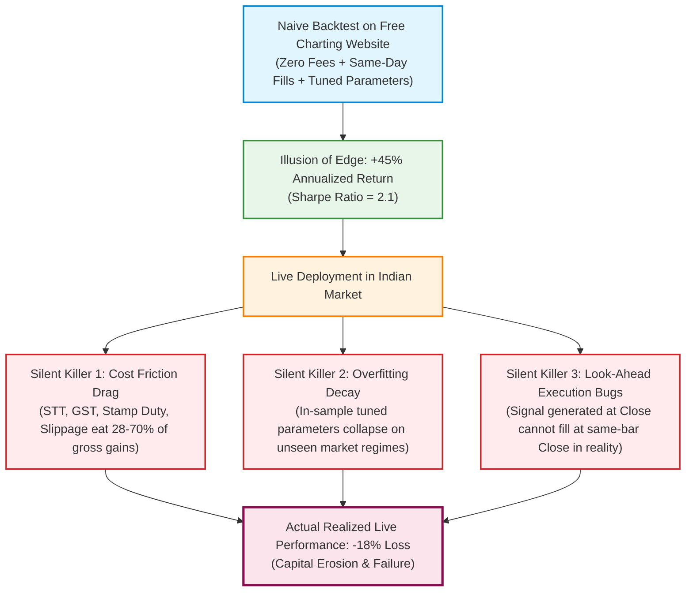

# QuantLab — Problem Statement & Empirical Market Grounding

**Project Title**: QuantLab: A Realistic Backtesting Engine & Overfitting Diagnostic Platform for Indian Equities  
**Course Code**: GTU DI05000341 (Minor Project — Semester 5)  
**Academic Unit**: Unit 1 — Problem Identification & Literature-Grounded Domain Study  
**Authors**: Aayush Avinash Bankar (Leader) & Meet Jayeshbhai Patel  
**Date**: August 16, 2026  

---

## 1. Executive Summary

Algorithmic and systematic trading strategies frequently present an illusion of exceptional profitability when evaluated through naive backtesting scripts or retail charting platforms. In live market deployment, however, the overwhelming majority of systematic retail strategies underperform or fail entirely.

This document establishes the empirical, economic, and technical grounding for **QuantLab**. By analyzing official empirical market data published by the **Securities and Exchange Board of India (SEBI)**, we identify the systemic causes of retail trading failure and formalize the research questions, academic hypotheses, and engineering objectives of the project.

---

## 2. Real-World Context: The Indian Retail Trading Boom

Between 2020 and 2026, the Indian capital market experienced an unprecedented surge in retail participation:
- Total registered investor Demat accounts grew from **~4.09 Crore in March 2020 to over 16.0 Crore by 2024–2026** (a >290% increase) [SEBI Bulletin, 2024].
- Retail participation in equity cash and derivatives segments reached record highs, fueled by zero-commission discount brokers, accessible charting platforms (TradingView, Chartink), and social media trading educators.
- A central marketing narrative presented to retail participants is that simple, rule-based technical indicators (such as Simple Moving Average crossovers, Relative Strength Index oscillators, and momentum filters) offer consistent, effortless market alpha.

---

## 3. The Hard Reality: SEBI's 2024 Official Empirical Studies

To assess the actual profitability of individual retail participants, the **Securities and Exchange Board of India (SEBI)** published comprehensive empirical studies (*"Analysis of Profit and Loss of Individual Traders"*, released in January 2023, July 2024, and September 2024) [SEBI, 2024a; SEBI, 2024b]:

```
┌─────────────────────────────────────────────────────────────────────────────┐
│                    SEBI OFFICIAL EMPIRICAL STUDY FINDINGS                   │
├───────────────────────────────────────────────┬─────────────────────────────┤
│ 93.0% Net Loss Makers                         │ 7.0% Net Profitable         │
│ (₹1,81,000+ Crore Cumulative Capital Destroyed)│ (<1% Earned > ₹1 Lakh)      │
└───────────────────────────────────────────────┴─────────────────────────────┘
```

### Key Empirical Findings (SEBI September 2024 Study):
1. **93% Loss-Making Rate**: Analyzing data across over **1 Crore unique individual traders** from FY22 to FY24, SEBI found that **93.0% of individual traders incurred net losses** [SEBI, 2024b].
2. **₹1.81 Lakh Crore Aggregate Wealth Destruction**: Individual retail traders collectively lost over **₹1,81,000 Crore (~$21.8 Billion USD)** across the three-year period [SEBI, 2024b].
3. **Average Loss**: The average loss per trader was approximately **₹2,00,000 per year** [SEBI, 2024b].
4. **Top 1% Super-Performers**: Only **1.0% of individual traders** managed to earn net profits exceeding ₹1,00,000 after adjusting for transaction costs [SEBI, 2024b].
5. **Intraday Cash Segment Losses**: In a complementary study released in July 2024, SEBI revealed that **71% (7 out of 10) individual intraday traders in the equity cash segment also incurred consistent losses** [SEBI, 2024a].
6. **Compounding Friction Drag**: Transaction costs (brokerages, STT, exchange turnover fees, GST, and stamp duty) accounted for roughly **28% of the total retail losses** [SEBI, 2024b].

---

## 4. Problem Identification: The "Three Silent Killers" of Systematic Trading

Why do millions of retail participants deploy trading strategies that are mathematically doomed? The fundamental cause lies in **defective, naive backtesting methodology**.



### 4.1 Killer #1: Transaction Cost Blindness & Market Microstructure Friction
Most retail tools simulate trading under **zero-friction assumptions**. In reality, Indian equity delivery transactions are subject to:
1. **Statutory Taxes**: Securities Transaction Tax (STT, 0.10% on buy and sell), Stamp Duty (0.015% on buy), and Goods & Services Tax (GST, 18% on fees) [Ministry of Finance, 2020].
2. **Exchange & Regulatory Levies**: NSE exchange turnover charges (~0.00297% - 0.00345%), SEBI turnover fees (0.0001%), and broker commissions.
3. **Execution Slippage**: Bid-ask spread crossing and latency delays ($\sim 0.05\% - 0.15\%$) [Kissell & Glantz, 2003].

A high-turnover strategy (e.g., daily momentum) trading 80–100 times a year faces an aggregate friction drag of $100 \times 0.35\% = 35.0\%$ per year, instantly turning an apparent $+25\%$ gain into a $-10\%$ loss.

### 4.2 Killer #2: Overfitting & Data Snooping (Multi-Testing Bias)
Retail users iteratively test dozens of parameter variations (e.g., SMA periods from 5 to 200, RSI levels from 20 to 80) and select the single combination that produced the highest historical return.
- **The Fallacy**: As proven by *White (2000)* and *Bailey & López de Prado (2014)*, when $N$ parameter combinations are tested on the same dataset, the maximum observed Sharpe ratio increases purely as a statistical artifact of multi-testing, fitting random historical noise rather than genuine market structure.
- **The Consequence**: When deployed on unseen future data, the strategy's apparent edge degrades to zero or turns negative.

### 4.3 Killer #3: Look-Ahead Bias (Temporal Leakage)
Standard vectorized Python scripts frequently calculate technical signals using the `Close` price of Day $t$, and assume the trade was executed at that exact same `Close` price.
- **The Physical Impossibility**: By the time the official market closing price is established (15:30 IST on NSE), the market is closed. A real order can only be executed at the **Opening price of Day $t+1$** (or during the next continuous auction session).

---

## 5. Formal Problem Statement

> **Problem Statement**:  
> Current student-accessible and retail-oriented backtesting platforms fail to model the combined impact of **statutory Indian market frictions (STT, GST, Stamp Duty, Slippage)**, **temporal execution constraints (zero look-ahead $t+1$ Open execution)**, and **statistical multi-testing adjustments (Deflated Sharpe Ratio)**. Consequently, users make capital allocation decisions based on overfitted, unverified historical simulations that mask catastrophic real-world degradation.  
>  
> There is a critical academic and engineering need for a transparent, from-scratch, discrete-event simulation engine that explicitly isolates, quantifies, and visualizes the exact transition from **gross theoretical paper profits** to **net realized out-of-sample returns** on Indian equities.

---

## 6. Core Research Questions (RQs)

| Research Question | Academic Scope & Objective |
|---|---|
| **RQ1: Friction Degradation** | *To what magnitude do statutory Indian equity delivery costs (STT, GST, Stamp Duty, Turnover) and execution slippage degrade the gross annualized return and Sharpe ratio across low-turnover vs high-turnover systematic strategies?* |
| **RQ2: Regime Generalizability** | *How severely does performance degrade when strategy parameters tuned on In-Sample data (2019–2022) are tested on unseen Out-of-Sample market regimes (2023–2024)?* |
| **RQ3: Statistical False Discovery** | *Does Marcos López de Prado's Deflated Sharpe Ratio (DSR) effectively identify and reject false-positive strategies that appear profitable under naive Sharpe calculations due to parameter multi-testing?* |
| **RQ4: Benchmark Alpha Relativity** | *Can canonical rule-based systematic strategies (SMA Trend-Following, RSI Mean-Reversion, Momentum) generate statistically significant, risk-adjusted excess alpha over the passive Nifty 50 Buy-and-Hold benchmark after all realistic frictions?* |

---

## 7. Formal Hypotheses

### Primary Hypothesis (Market Efficiency & Friction Drag)
- **Null Hypothesis ($H_0$)**:  
  $$\text{CAGR}_{\text{strategy, net}} \le \text{CAGR}_{\text{Nifty50}} \quad \text{and} \quad \text{Sharpe}_{\text{strategy, net}} \le \text{Sharpe}_{\text{Nifty50}}$$  
  *Canonical retail technical strategies (SMA, RSI, Momentum) generate zero statistically significant excess alpha over the passive Nifty 50 Buy-and-Hold benchmark after deducting statutory Indian delivery costs and slippage.*
- **Alternative Hypothesis ($H_1$)**:  
  $$\text{CAGR}_{\text{strategy, net}} > \text{CAGR}_{\text{Nifty50}} \quad \text{with } \text{DSR } p \text{-value} \ge 0.95$$  
  *At least one systematic strategy generates persistent, statistically validated risk-adjusted excess alpha after all transaction frictions.*

---

## 8. Academic References & Citations

1. **Bailey, D. H., Borwein, J. M., López de Prado, M., & Zhu, Q. V.** (2014). *Pseudo-Mathematics and Financial Charlatanism: The Effects of Backtest Overfitting on Out-of-Sample Performance*. Notices of the AMS, 61(5), 458-471.
2. **Bailey, D. H., & López de Prado, M.** (2014). *The Deflated Sharpe Ratio: Correcting for Selection Bias, Backtest Overfitting, and Non-Normality*. Journal of Portfolio Management, 40(5), 94–107.
3. **Brock, W., Lakonishok, J., & LeBaron, B.** (1992). *Simple Technical Trading Rules and the Stochastic Properties of Stock Returns*. The Journal of Finance, 47(5), 1731-1764.
4. **Kissell, R., & Glantz, M.** (2003). *Optimal Trading Strategies: Quantitative Approaches for Managing Market Impact and Trading Risk*. AMACOM / American Management Association.
5. **Ministry of Finance, Government of India.** (2020). *Uniform Stamp Duty Implementation under the Indian Stamp Act, 1899*. Circular w.e.f. July 1, 2020.
6. **Securities and Exchange Board of India (SEBI).** (2024a). *Study on Analysis of Profit and Loss of Individual Traders in Equity Cash Segment (Intraday)*. SEBI Research Report, July 2024. Available: https://www.sebi.gov.in
7. **Securities and Exchange Board of India (SEBI).** (2024b). *Analysis of Profit and Loss of Individual Traders in Equity Derivatives Segment (F&O) for FY22 to FY24*. SEBI Research Study, September 2024. Available: https://www.sebi.gov.in
8. **White, H.** (2000). *A Reality Check for Data Snooping*. Econometrica, 68(5), 1097-1126.
9. **Wilder, J. W.** (1978). *New Concepts in Technical Trading Systems*. Trend Research, Greensboro, NC.
