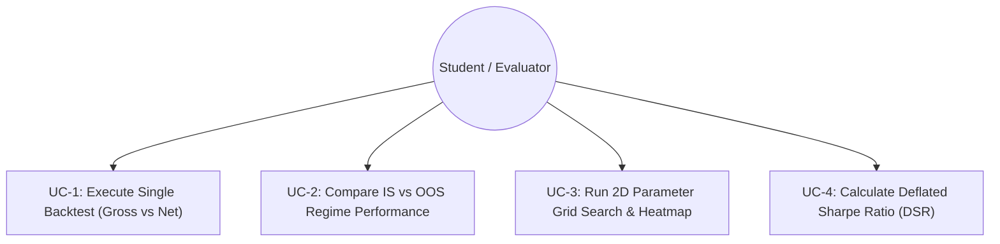

# QuantLab — Software Requirements Specification (SRS)

**Project Title**: QuantLab: A Realistic Backtesting Engine & Overfitting Diagnostic Platform for Indian Equities  
**Course Code**: GTU DI05000341 (Minor Project — Semester 5)  
**Standard**: IEEE Std 830-1998 Format  
**Academic Unit**: Unit 2 — Software Requirements Specification & Design Contracts  
**Authors**: Aayush Avinash Bankar (Leader) & Meet Jayeshbhai Patel  
**Date**: August 19, 2026  

---

## 1. Introduction

### 1.1 Purpose
This Software Requirements Specification (SRS) defines the functional and non-functional requirements for **QuantLab**, an event-driven backtesting and overfitting diagnostic platform designed for Indian equity markets. This document serves as the formal specification contract between the project requirements and the implementation phase in Unit 3.

### 1.2 Scope of the Software
QuantLab simulates algorithmic trading strategies on historical National Stock Exchange (NSE) equity data. It models exact statutory Indian transaction costs, enforces zero look-ahead execution timing, calculates comprehensive risk-adjusted metrics, and detects parameter overfitting using Marcos López de Prado's Deflated Sharpe Ratio (DSR).

### 1.3 Definitions & Acronyms
- **ADV**: Average Daily Volume (number of shares traded daily).
- **CAGR**: Compounded Annual Growth Rate.
- **DSR**: Deflated Sharpe Ratio (Marcos López de Prado, 2014).
- **HWM**: High-Water Mark (highest portfolio equity value achieved).
- **IS / OOS**: In-Sample (2019–2022) / Out-of-Sample (2023–2024).
- **MDD**: Maximum Drawdown.
- **NSE**: National Stock Exchange of India.
- **OHLCV**: Open, High, Low, Close, Volume price bars.
- **STT**: Securities Transaction Tax (statutory Indian tax).

---

## 2. Overall Description

### 2.1 Product Perspective & 4-Layer Architecture
QuantLab is an independent, self-contained Python software package consisting of four decoupled layers:

```
┌─────────────────────────────────────────────────────────────────────────────┐
│                    QUANTLAB 4-LAYER DECOUPLED ARCHITECTURE                  │
├─────────────────────────────────────────────────────────────────────────────┤
│ Layer 1: Streamlit Dashboard UI (`src/dashboard/`)                          │
│   • Interactive strategy controls, 'Profit Mirage' waterfall, 2D heatmaps   │
├─────────────────────────────────────────────────────────────────────────────┤
│ Layer 2: Analytics & Overfitting Engine (`src/analytics/`)                  │
│   • CAGR, Sharpe, Sortino, Calmar, MDD, López de Prado's Deflated Sharpe    │
├─────────────────────────────────────────────────────────────────────────────┤
│ Layer 3: Discrete-Event Simulation Core (`src/engine/`)                     │
│   • BacktestEngine, Portfolio, Order, Position, Indian CostModel            │
├─────────────────────────────────────────────────────────────────────────────┤
│ Layer 4: Data Ingestion & Strategy Layer (`src/data/`, `src/strategies/`)    │
│   • Yahoo Finance fetcher, data cleaner, SMA, RSI, Momentum generators      │
└─────────────────────────────────────────────────────────────────────────────┘
```

### 2.2 User Characteristics
The software is designed for academic examiners, quantitative finance researchers, and university students requiring a fully transparent, auditable, and mathematically rigorous backtesting tool.

### 2.3 General Constraints
1. Must execute on standard 64-bit operating systems (Linux, macOS, Windows).
2. Must use 100% free, open-source Python libraries (Python 3.11+).
3. Total budget: ₹0.00 (Zero paid APIs, zero commercial cloud requirements).

---

## 3. Specific Functional Requirements (FR-1 to FR-12)

```
┌─────────────────────────────────────────────────────────────────────────────┐
│                    12 FUNCTIONAL REQUIREMENTS (FR-1 to FR-12)               │
├─────────┬───────────────────────────────┬───────────────────────────────────┤
│ Req ID  │ Requirement Name              │ Description                       │
├─────────┼───────────────────────────────┼───────────────────────────────────┤
│ FR-1    │ Automated Data Ingestion      │ Fetch NSE OHLCV data via yfinance │
│ FR-2    │ Data Cleaning & Validation    │ Handle splits, dividends, NaNs    │
│ FR-3    │ Universe Configuration        │ Support 10 NSE stocks + Nifty 50  │
│ FR-4    │ Regime Partitioning (IS/OOS)  │ Split 2019-2022 (IS) & 2023-24(OOS│
│ FR-5    │ SMA Crossover Strategy        │ Generate signals on SMA cross     │
│ FR-6    │ RSI Mean-Reversion Strategy   │ Generate signals on RSI extremes  │
│ FR-7    │ Momentum Lookback Strategy    │ Generate signals on lookback return│
│ FR-8    │ Zero Look-Ahead Event Loop    │ Signal at t Close -> Fill at t+1 Op│
│ FR-9    │ Indian Statutory Cost Model   │ Deduct STT, GST, Stamp, Slippage  │
│ FR-10   │ Performance & Risk Engine     │ Compute CAGR, Sharpe, Sortino, MDD│
│ FR-11   │ Deflated Sharpe Ratio (DSR)   │ Compute DSR adjusting for N trials│
│ FR-12   │ Parameter Stability Search    │ Generate 2D parameter heatmaps    │
└─────────┴───────────────────────────────┴───────────────────────────────────┘
```

### Detailed Functional Specifications:

- **FR-1 (Data Ingestion)**: The system shall download daily OHLCV historical price data for any valid NSE ticker using `yfinance` and store cached raw CSVs in `data/raw/`.
- **FR-2 (Data Cleaning)**: The system shall validate that all price bars have positive prices ($P > 0$), remove zero-volume trading holidays, adjust for corporate splits/dividends, and save validated data in `data/processed/`.
- **FR-3 (Universe Selection)**: The system shall configure and maintain the 10 liquid Indian equity universe (`RELIANCE.NS`, `BHARTIARTL.NS`, `HDFCBANK.NS`, `ICICIBANK.NS`, `SBIN.NS`, `TCS.NS`, `LT.NS`, `ITC.NS`, `HINDUNILVR.NS`, `INFY.NS`) and the benchmark `^NSEI`.
- **FR-4 (Date Partitioning)**: The system shall enforce date segmentation into In-Sample (`2019-01-01` to `2022-12-31`) and Out-of-Sample (`2023-01-01` to `2024-12-31`).
- **FR-5 (SMA Crossover)**: The system shall compute Fast SMA ($S$) and Slow SMA ($L$) and emit $+1$ (BUY) on golden cross and $-1$ (SELL) on death cross.
- **FR-6 (RSI Mean-Reversion)**: The system shall compute Wilder's 14-day RSI and emit $+1$ (BUY) when $\text{RSI} < 30$ and $-1$ (SELL) when $\text{RSI} > 70$.
- **FR-7 (Momentum Lookback)**: The system shall compute $L$-day rate of change and emit $+1$ (BUY) when momentum $> 0$ and $-1$ (SELL) when momentum $\le 0$.
- **FR-8 (Zero Look-Ahead Execution)**: The system shall process daily bars sequentially; orders generated at Day $t$ Close shall execute strictly at Day $t+1$ Open price.
- **FR-9 (Indian Statutory Cost Model)**: The system shall compute and deduct STT (0.10% buy/sell), Stamp Duty (0.015% buy), NSE fee (0.00297%), SEBI fee (0.0001%), GST (18% on fees), Brokerage (0.03% capped at ₹20), and Slippage ($\pm 0.05\%$) per trade.
- **FR-10 (Performance & Risk Analytics)**: The system shall output Total Return, CAGR, Annualized Sharpe ($R_f=6.0\%$), Sortino Ratio, Maximum Drawdown, and Calmar Ratio.
- **FR-11 (Deflated Sharpe Ratio)**: The system shall compute López de Prado's DSR p-value adjusting for total parameter trials $N$, sample skewness, and sample kurtosis.
- **FR-12 (2D Parameter Grid Search)**: The system shall execute grid evaluations across 2 strategy parameters (e.g., Fast SMA 5–50 vs Slow SMA 20–200) and export results to `experiments/experiment_log.csv`.

---

## 4. Non-Functional Requirements (NFR-1 to NFR-6)

| Req ID | Non-Functional Area | Requirement Specification |
|---|---|---|
| **NFR-1** | **Determinism** | Given identical input OHLCV data and parameters, simulation output must be 100% mathematically identical across runs. |
| **NFR-2** | **Performance & Speed** | A 6-year backtest on a single stock must execute in $<0.25\text{ seconds}$. Full 12-cell matrix must complete in $<5.0\text{ seconds}$. |
| **NFR-3** | **Decoupling** | Engine layers must have zero circular imports; simulation core must run headlessly without Streamlit. |
| **NFR-4** | **Testability** | 100% of core mathematical functions and engine classes must pass automated unit tests in Pytest. |
| **NFR-5** | **Usability** | Interactive Streamlit dashboard must render responsive charts within $<1.0\text{ second}$ of parameter changes. |
| **NFR-6** | **Open Source** | All code must be licensed under standard open-source licenses (MIT) with zero proprietary dependencies. |

---

## 5. Use Case Models



### Use Case UC-1: Execute Single Backtest
- **Actor**: Student / Evaluator.
- **Precondition**: Cleaned OHLCV data exists in `data/processed/`.
- **Main Flow**:
  1. User selects Stock (`RELIANCE.NS`), Strategy (`SMA Crossover`), and Initial Capital (`₹10,00,000`).
  2. Engine runs simulation and computes gross and net equity curves.
  3. UI displays "Profit Mirage" waterfall chart decomposing friction drag.

### Use Case UC-2: In-Sample vs. Out-of-Sample Regime Decay
- **Main Flow**:
  1. Engine fits optimal parameters on In-Sample (2019–2022).
  2. Engine applies frozen parameters to Out-of-Sample (2023–2024).
  3. System displays percentage degradation in Sharpe ratio and returns.

---

## 6. System Verification Contract

In Unit 3, every requirement from FR-1 through FR-12 will be mapped 1:1 to an automated test fixture in `tests/`:
- `tests/test_data.py`: Verifies FR-1, FR-2, FR-3, FR-4.
- `tests/test_strategies.py`: Verifies FR-5, FR-6, FR-7.
- `tests/test_engine.py`: Verifies FR-8.
- `tests/test_cost_model.py`: Verifies FR-9 (down to the paisa).
- `tests/test_metrics.py`: Verifies FR-10, FR-11.
