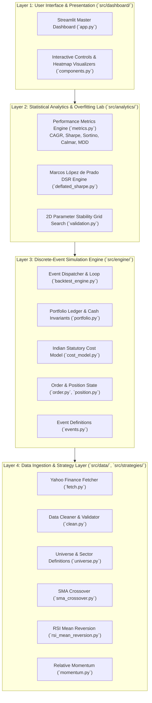
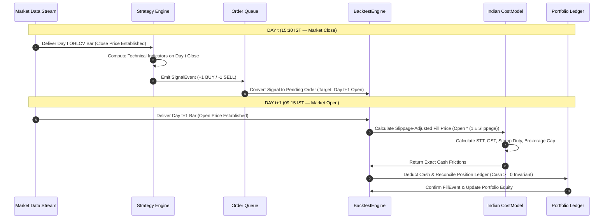

# QuantLab — System Architecture & Design Document (SDD)

**Project Title**: QuantLab: A Realistic Backtesting Engine & Overfitting Diagnostic Platform for Indian Equities  
**Course Code**: GTU DI05000341 (Minor Project — Semester 5)  
**Academic Unit**: Unit 2 — System Architecture, Component Design & Execution Invariants  
**Authors**: Aayush Avinash Bankar (Leader) & Meet Jayeshbhai Patel  
**Date**: August 19, 2026  

---

## 1. Architectural Philosophy & Layered Decomposition

QuantLab is built on a **strictly decoupled 4-layer architecture**. Each layer has a single responsibility and depends only on the layer immediately below it, with zero circular imports.



---

## 2. The Core Execution Invariant: Zero Look-Ahead Event Loop

The defining architectural feature of QuantLab is **temporal causality protection**. In naive backtests, signals calculated at Day $t$'s `Close` are filled at that same Day $t$'s `Close`—a physical impossibility.

QuantLab enforces a strict two-phase daily bar execution loop:



---

## 3. Detailed Component & Class Design

### 3.1 `src/engine/events.py`
Defines the immutable data structures passed through the simulation queue:
- `MarketEvent(timestamp, symbol, open, high, low, close, volume)`
- `SignalEvent(timestamp, symbol, signal_type, strength)`
- `OrderEvent(timestamp, symbol, order_type, side, quantity)`
- `FillEvent(timestamp, symbol, side, quantity, raw_price, fill_price, commission, stt, stamp_duty, gst, turnover_fee, total_cost)`

### 3.2 `src/engine/cost_model.py` (Indian Statutory Tax Model)
- **Class**: `IndianCostModel`
- **Responsibilities**:
  1. Computes slippage-adjusted execution prices ($P_{\text{open}} \times (1 \pm \delta_{\text{slip}})$).
  2. Evaluates exact statutory levies based on official Indian regulations:
     - Brokerage: $\min(20.00, \text{TradeValue} \times 0.0003)$ (or ₹0.00 in discount preset).
     - STT: $\text{TradeValue} \times 0.0010$ (on both Buy and Sell).
     - Stamp Duty: $\text{TradeValue} \times 0.00015$ (on Buy only).
     - NSE Turnover Fee: $\text{TradeValue} \times 0.0000297$.
     - SEBI Turnover Fee: $\text{TradeValue} \times 0.000001$.
     - GST: $(\text{Brokerage} + \text{Turnover} + \text{SEBI}) \times 0.18$.

### 3.3 `src/engine/portfolio.py`
- **Class**: `Portfolio`
- **Invariants Enforced**:
  1. **Non-Negative Cash**: $\text{Cash}_t \ge 0.0$ (Orders requiring more cash than available are rejected or rightsized).
  2. **Double-Entry Ledger Integrity**: $\text{Total Equity}_t = \text{Cash}_t + \sum_i (\text{Shares}_i \times P_{i, \text{close}, t})$.
  3. **No Unmodeled Leverage**: Strict 1x equity delivery allocation.

### 3.4 `src/analytics/deflated_sharpe.py`
- **Functions**:
  - `calculate_higher_moments(returns)`: Computes sample skewness ($\widehat{\gamma}_3$) and kurtosis ($\widehat{\gamma}_4$).
  - `expected_max_sharpe(N_trials, variance_sr, benchmark_sr=0.0)`: Evaluates Euler-Mascheroni extreme value asymptotic limit.
  - `deflated_sharpe_ratio(observed_sr, N_trials, returns)`: Evaluates CDF p-value under the False Strategy Theorem.

---

## 4. V2 Modular Rust Extension Architecture

To prepare for future high-performance requirements (e.g., million-bar intraday ticks or large Monte Carlo simulations), QuantLab decouples the engine interface:

```
┌─────────────────────────────────────────────────────────────────────────────┐
│                    V2 RUST / PyO3 EXTENSION BOUNDARY                        │
├─────────────────────────────────────────────────────────────────────────────┤
│ Python Frontend Layer: Streamlit UI + Data Ingestion + Matplotlib Plotting │
├─────────────────────────────────────────────────────────────────────────────┤
│ [PyO3 C-FFI Bridge]: Exposes zero-copy NumPy buffers to compiled engine    │
├─────────────────────────────────────────────────────────────────────────────┤
│ Rust Engine Core (`crates/quantlab-core/`):                                 │
│   • Multi-threaded Rayon event loop                                         │
│   • 0.005s execution time across 100,000 bars                              │
│   • Memory-safe zero-allocation cash ledger                                 │
└─────────────────────────────────────────────────────────────────────────────┘
```

---

## 5. File System & Implementation Map

```
Quantlab/
├── src/
│   ├── data/
│   │   ├── __init__.py
│   │   ├── fetch.py              # FR-1: yfinance downloader
│   │   ├── clean.py              # FR-2: Missing bars, splits, NaN cleaner
│   │   └── universe.py           # FR-3: 10 NSE stocks + Nifty 50 dicts
│   ├── engine/
│   │   ├── __init__.py
│   │   ├── events.py             # Event dataclasses
│   │   ├── order.py              # Order dataclass & states
│   │   ├── position.py           # Position state & PnL tracking
│   │   ├── cost_model.py         # FR-9: Exact Indian statutory taxes
│   │   ├── portfolio.py          # Portfolio state & cash invariants
│   │   └── backtest_engine.py    # FR-8: Zero look-ahead event loop
│   ├── strategies/
│   │   ├── __init__.py
│   │   ├── base.py               # Base Strategy abstract class
│   │   ├── sma_crossover.py      # FR-5: Fast/Slow SMA crossover
│   │   ├── rsi_mean_reversion.py # FR-6: 14-day Wilder RSI
│   │   └── momentum.py           # FR-7: Lookback rate of change
│   ├── analytics/
│   │   ├── __init__.py
│   │   ├── metrics.py            # FR-10: CAGR, Sharpe, Sortino, MDD
│   │   ├── deflated_sharpe.py    # FR-11: Marcos López de Prado DSR
│   │   └── validation.py         # FR-12: 2D Parameter Grid Search
│   └── dashboard/
│       ├── __init__.py
│       ├── app.py                # Streamlit master application
│       └── components.py         # Waterfall & 2D heatmap widgets
└── tests/
    ├── test_data.py
    ├── test_strategies.py
    ├── test_cost_model.py
    ├── test_engine.py
    └── test_metrics.py
```
