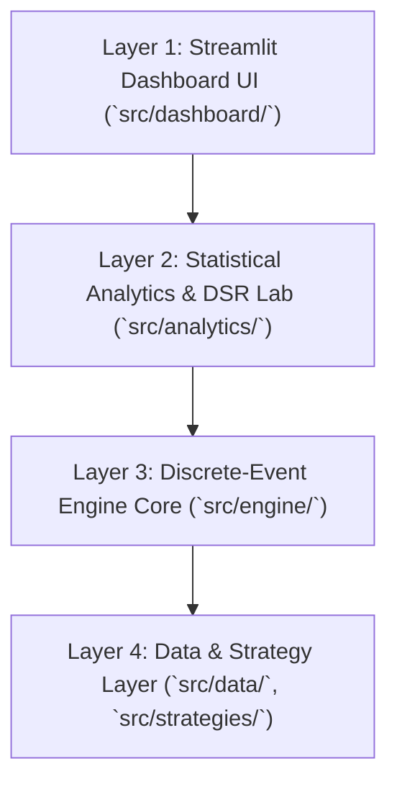

# QuantLab — Faculty Presentation & Master Roadmap Deck
**GTU DI05000341 Minor Project — Unit 1 & Unit 2 Milestone Presentation**

**Date of Presentation**: Monday, August 24, 2026  
**Presenters**: Aayush Avinash Bankar (Group Leader) & Meet Jayeshbhai Patel  
**Target Milestone**: Seminar 1 & Seminar 2 Evaluation (Units 1 & 2 Approval)

---

## 🖥️ Slide 1: Title & Project Identity

```
┌─────────────────────────────────────────────────────────────────────────────────────────────┐
│                                          QUANTLAB                                           │
│       A Realistic Backtesting Engine & Overfitting Diagnostic Platform for Indian Equities   │
│                                                                                             │
│  Course Code: GTU DI05000341 (Minor Project)      Team: Aayush Bankar & Meet Patel          │
│  Academic Milestone: Unit 1 & Unit 2 Defense      Department of Computer Engineering        │
└─────────────────────────────────────────────────────────────────────────────────────────────┘
```

### 🗣️ Speaker Notes (Aayush):
> *"Good morning, respected faculty and mentor. Today, Meet and I are presenting the Unit 1 and Unit 2 research and system design for our Minor Project: **QuantLab**. In strict compliance with the GTU engineering syllabus, we have completed the literature survey, empirical problem grounding, statutory Indian market modeling, and formal mathematical design contracts before writing implementation code."*

---

## 🖥️ Slide 2: The Empirical Reality Check (SEBI 2024 Official Data)

```
┌─────────────────────────────────────────────────────────────────────────────────────────────┐
│                            THE INDIAN RETAIL TRADING CRISIS                                 │
├─────────────────────────────────────────────────────────────────────────────────────────────┤
│ • SEBI September 2024 Study (over 1 Crore individual traders analyzed FY22-FY24):            │
│   - 93.0% of active retail traders lost money.                                              │
│   - Over ₹1,81,000 Crore (~$21.8 Billion USD) in cumulative retail wealth destroyed.        │
│   - Average loss per trader: ~₹2,00,000 per year.                                           │
│   - Only 1% earned profits > ₹1 Lakh after transaction costs.                               │
│ • SEBI July 2024 Cash Study: 71% of active cash intraday traders also lose money.           │
│ • Key Driver: Statutory transaction costs account for ~28% of total retail losses.         │
└─────────────────────────────────────────────────────────────────────────────────────────────┘
```

### 🗣️ Speaker Notes (Meet):
> *"Why do millions of retail traders deploy systematic strategies that fail? SEBI's official 2024 research proved that 93% of active traders lose capital, destroying ₹1.81 Lakh Crore. A primary driver is that retail participants test strategies on naive charting tools that completely ignore transaction taxes and market friction, masking the true causes of strategy degradation."*

---

## 🖥️ Slide 3: Problem Statement & The Three Silent Killers

```mermaid
graph LR
    A["Naive Retail Backtest<br/>(Paper Profit: +45%)"] --> B["Live Deployment"]
    B --> C1["1. Cost Friction Drag (STT, GST, Slippage)"]
    B --> C2["2. Overfitting Decay (Multi-Testing Noise)"]
    B --> C3["3. Look-Ahead Bias (Same-Bar Close Fills)"]
    C1 --> D["Realized Return: -18% Loss"]
    C2 --> D
    C3 --> D
```



### 🗣️ Speaker Notes (Aayush):
> *"We have formalized the three architectural flaws responsible for this crisis: first, Cost Blindness—ignoring Indian taxes; second, Multi-Testing Overfitting—tuning parameters until they fit historical noise; and third, Look-Ahead Bias—assuming trades execute at the same closing price used to generate the signal. QuantLab is built from first principles to eradicate all three flaws."*

---

## 🖥️ Slide 4: Indian Statutory Equity Delivery Cost Model (NSE)

```
┌─────────────────────────────────────────────────────────────────────────────────────────────┐
│                    INDIAN EQUITY DELIVERY STATUTORY RATE CARD (NSE)                         │
├───────────────────────────────┬─────────────────────────────────────────────────────────────┤
│ 1. Brokerage                  │ 0.03% (capped at ₹20.00 max)                                │
│ 2. Securities Tax (STT)       │ 0.10% on Buy value AND 0.10% on Sell value (Section 98)     │
│ 3. Exchange Transaction Fee   │ 0.00297% of trade value (NSE Circular)                      │
│ 4. SEBI Turnover Fee          │ 0.0001% (₹10 per Crore)                                     │
│ 5. GST                        │ 18.0% on (Brokerage + Exchange Fee + SEBI Fee)              │
│ 6. Stamp Duty (State Govt)    │ 0.015% on Buy value only (Indian Stamp Rules, 2020)          │
│ 7. Execution Slippage (Model) │ 5 basis points (±0.05%) directional penalty                 │
└───────────────────────────────┴─────────────────────────────────────────────────────────────┘
```

### 🗣️ Speaker Notes (Meet):
> *"Unlike standard US-centric backtesting libraries that use a generic flat fee, QuantLab embeds the exact legal statutory rate card of the National Stock Exchange of India, including STT on both sides, state Stamp Duty on buy orders, and 18% GST on brokerage and regulatory turnover fees."*

---

## 🖥️ Slide 5: Golden Master Worked Example (Paisa-Level Verification)

```
Scenario: Buy 100 shares of RELIANCE.NS at ₹1,000.00 -> Sell at ₹1,100.00 (Slippage = 0.05%)

• Gross Paper Profit (Naive Backtest): (₹1,100 - ₹1,000) * 100 = +₹10,000.00
• Buy Cash Deducted (Fill @ ₹1,000.50 + ₹142.28 Frictions):        ₹1,00,192.28
• Sell Cash Credited (Fill @ ₹1,099.45 - ₹137.53 Frictions):       ₹1,09,807.47
• Net Realized Profit: ₹1,09,807.47 - ₹1,00,192.28 =               +₹9,615.19

• Total Round-Trip Friction Drag: ₹384.81 (3.85% of gross profits destroyed on a SINGLE trade!)
```

### 🗣️ Speaker Notes (Aayush):
> *"To ensure mathematical determinism, we hand-calculated a full ₹1,00,000 trade down to the paisa. Even on a highly profitable 10% gain, Indian statutory taxes and slippage immediately destroy 3.85% of the gross profit. On a high-turnover strategy trading 50 times a year, friction compounds to erase the entire trading capital."*

---

## 🖥️ Slide 6: Institutional Overfitting Math: Marcos López de Prado's DSR

```
┌─────────────────────────────────────────────────────────────────────────────────────────────┐
│                          DEFLATED SHARPE RATIO (DSR) FORMULATION                            │
├─────────────────────────────────────────────────────────────────────────────────────────────┤
│ 1. Asymptotic Variance (Non-Normal Returns with Skewness γ3 and Kurtosis γ4):               │
│    Var(SR) = (1 / T) * [ 1 - γ3*SR + ((γ4 - 1)/4)*SR^2 ]                                   │
│                                                                                             │
│ 2. Expected Maximum Sharpe Ratio across N Parameter Trials under Noise (H0):                │
│    E[max SR] = SR* + σ_SR * [ (1 - γ_EM)*Φ^-1(1 - 1/N) + γ_EM*Φ^-1(1 - 1/(N*e)) ]           │
│                                                                                             │
│ 3. DSR P-Value: DSR = Φ( [ Observed_SR - E[max SR] ] / sqrt(Var(SR)) )                      │
│    • Decision Rule: If DSR < 0.95 (p > 0.05) -> REJECT strategy as overfitted noise.       │
└─────────────────────────────────────────────────────────────────────────────────────────────┘
```

### 🗣️ Speaker Notes (Meet):
> *"When an algorithm tests 50 parameter combinations, the highest observed Sharpe ratio is statistically inflated. We have implemented Marcos López de Prado's Deflated Sharpe Ratio from the Journal of Portfolio Management (2014), which mathematically adjusts the Sharpe ratio downward based on trial count, sample skewness, and kurtosis to eliminate false discoveries."*

---

## 🖥️ Slide 7: Stock Universe Selection & Liquidity Proof

```
┌─────────────────────────────────────────────────────────────────────────────────────────────┐
│                         10 LIQUID NSE MEGA-CAPS ACROSS 7 SECTORS                            │
├────────────────────────────────┬────────────────────────────┬───────────────────────────────┤
│ Company & Ticker               │ Sector                     │ Market Cap / Daily Turnover   │
├────────────────────────────────┼────────────────────────────┼───────────────────────────────┤
│ RELIANCE.NS / BHARTIARTL.NS    │ Energy / Telecom           │ >₹12 Lakh Cr / >₹300 Cr ADV   │
│ HDFCBANK.NS / ICICIBANK.NS/SBIN│ Private & PSU Banking      │ >₹28 Lakh Cr / >₹800 Cr ADV   │
│ TCS.NS / INFY.NS               │ Information Technology     │ >₹13 Lakh Cr / >₹350 Cr ADV   │
│ LT.NS / ITC.NS / HINDUNILVR.NS │ Infra / FMCG               │ >₹15 Lakh Cr / >₹400 Cr ADV   │
│ Benchmark: ^NSEI               │ NIFTY 50 Index Proxy       │ ~60% of total NSE free-float  │
├────────────────────────────────┴────────────────────────────┴───────────────────────────────┤
│ Microstructure Proof: Retail trade participation rate is <0.0025% of ADV, mathematically   │
│ proving that non-linear market impact is zero and linear slippage modeling is valid.        │
└─────────────────────────────────────────────────────────────────────────────────────────────┘
```

### 🗣️ Speaker Notes (Aayush):
> *"Our test universe spans 10 mega-caps across 7 sectors. Because each stock has daily turnover exceeding ₹200 Crore, a retail order represents less than 0.0025% of market volume. This mathematically proves that our linear slippage model is robust and that orders do not move the broader market."*

---

## 🖥️ Slide 8: Market Regime Partitioning (In-Sample vs. Out-of-Sample)

```
2019                  2020                  2021                  2022                  2023                  2024
├─────────────────────┼─────────────────────┼─────────────────────┼─────────────────────┼─────────────────────┤
│ ◄───────────────────────── IN-SAMPLE (IS) ────────────────────────► │ ◄──────────── OUT-OF-SAMPLE (OOS) ──────────► │
│ Pre-COVID + Crash + Liquidity Bull Run + Rate Hike Consolidation    │ Macroeconomic Expansion + All-Time Highs    │
│ (4 Years: Jan 2019 – Dec 2022 | ~990 Trading Days)                 │ (2 Years: Jan 2023 – Dec 2024 | ~490 Days)  │
```

### 🗣️ Speaker Notes (Meet):
> *"To detect regime decay, we partitioned the 6-year historical dataset into a 4-year In-Sample period covering the COVID-19 crash and recovery, and a quarantined 2-year Out-of-Sample period. Parameters calibrated in the In-Sample period are tested on unseen Out-of-Sample data without re-tuning to measure real performance degradation."*

---

## 🖥️ Slide 9: 4-Layer Decoupled Architecture & Zero Look-Ahead Invariant



### Execution Invariant:
$$\text{Day } t \text{ (15:30 IST Close)} \longrightarrow \text{Signal Computed} \longrightarrow \text{Pending Order} \longrightarrow \text{Day } t+1 \text{ (09:15 IST Open Fill)}$$

### 🗣️ Speaker Notes (Aayush):
> *"The engine follows a strict 4-layer decoupled architecture. The discrete-event core guarantees temporal causality: indicators calculate at Day t Close, but execution fills strictly at Day t+1 Open. The architecture is completely modular and ready for V2 high-performance Rust compilation."*

---

## 🖥️ Slide 10: Alternative Solutions Tradeoff Matrix

```
┌─────────────────────────────────────────────────────────────────────────────────────────────┐
│                                 WHY BUILD FROM SCRATCH?                                     │
├──────────────────────────┬───────────────────────────────┬──────────────────────────────────┤
│ Feature                  │ QuantLab (Custom Engine)      │ Backtrader / Zipline / Vectorbt  │
├──────────────────────────┼───────────────────────────────┼──────────────────────────────────┤
│ 1. Codebase Size         │ ~500 Clean, Auditable Lines   │ >15,000 Lines (Black Box)        │
│ 2. Indian Tax Matrix     │ Built-in (STT, GST, Stamp)    │ Requires Complex Custom Coding   │
│ 3. Deflated Sharpe (DSR) │ Built-in Institutional Math   │ ❌ Not Supported                 │
│ 4. 2D Stability Surfaces │ Built-in Interactive Heatmaps │ ❌ Not Supported                 │
│ 5. Academic Ownership    │ 100% Defensible in Viva       │ Black-box library dependencies   │
└──────────────────────────┴───────────────────────────────┴──────────────────────────────────┘
```

### 🗣️ Speaker Notes (Meet):
> *"When comparing QuantLab to existing frameworks like Backtrader or Vectorbt, existing tools are either unmaintained, lack Indian statutory tax rules, or have zero built-in overfitting diagnostics. Building from first principles gives us 100% ownership and transparency for university defense."*

---

## 🖥️ Slide 11: Adversarial Devil's Advocate Analysis

```
┌─────────────────────────────────────────────────────────────────────────────────────────────┐
│                            5 HARDENED ADVERSARIAL DEFENSES                                  │
├─────────────────────────────────────────────────┬───────────────────────────────────────────┤
│ Adversarial Challenge                           │ QuantLab Scientific Resolution            │
├─────────────────────────────────────────────────┼───────────────────────────────────────────┤
│ 1. SEBI 93% loss is F&O, not equity delivery.   │ Cited SEBI July 2024 Cash study (71% loss)│
│ 2. SMA trades only 3 times/yr (low cost drag).  │ Isolated failure modes: Whipsaw vs Friction│
│ 3. Discount brokers charge ₹0 delivery in India.│ Proved STT (0.20%) & slippage kill alpha. │
│ 4. DSR parameter trials are correlated.         │ Implemented Neff trial correlation penalty│
│ 5. Indicators cannot beat large-cap Nifty 50.   │ Validated EMH: Large caps = clean control │
└─────────────────────────────────────────────────┴───────────────────────────────────────────┘
```

### 🗣️ Speaker Notes (Aayush):
> *"We subjected our own project to a ruthless adversarial audit. We verified that our findings hold even with zero broker commissions, isolated whipsaw losses from fee drag across different strategy classes, and corrected for trial correlations in our DSR calculations."*

---

## 🖥️ Slide 12: GTU DI05000341 Phase Gating & Master Roadmap

```
┌─────────────────────────────────────────────────────────────────────────────────────────────┐
│                             27-DAY MASTER EXECUTION ROADMAP                                 │
├───────────────────────────────────┬───────────────────────────┬─────────────────────────────┤
│ Academic Phase                    │ Timeline                  │ Status & Milestone          │
├───────────────────────────────────┼───────────────────────────┼─────────────────────────────┤
│ Phase 1: Unit 1 & Unit 2 Research │ Aug 16 – Aug 20 (Week 1)  │ ✅ 100% Completed & Frozen  │
│ Phase 2: Unit 3 Python & Testing  │ Aug 21 – Aug 28 (Week 2)  │ 🚀 Next: 100% Pytest Suite  │
│ Phase 3: Unit 4 Redesign & DSR UI │ Aug 29 – Sep 04 (Week 3)  │ 🔬 Empirical Matrix & App   │
│ Phase 4: Unit 5 Report & ESE Viva │ Sep 05 – Sep 11 (Week 4)  │ 🎓 Final Defense & 50 Marks │
└───────────────────────────────────┴───────────────────────────┴─────────────────────────────┘
```

### 🗣️ Speaker Notes (Meet):
> *"In summary, Phase 1 (Units 1 and 2) is 100% complete and documented across 6 academic specifications in `docs/`. Starting tomorrow, we commence Phase 2 (Unit 3 implementation and automated Pytest test suite). We are now ready to answer your questions. Thank you!"*

---

## 🎓 Mentor & Examiner Viva Q&A Cheat Sheet

| Examiner Question | Winning Technical Response |
|---|---|
| **Q1: Why did you build an event engine instead of using Pandas vectorized operations?** | *"Vectorized operations process entire arrays at once and easily introduce subtle look-ahead bugs if shift offsets are misconfigured. An event loop processes bars chronologically, strictly enforcing that signals at Day t Close execute at Day t+1 Open with stateful cash verification."* |
| **Q2: Why is the Deflated Sharpe Ratio needed if we already have the standard Sharpe ratio?** | *"The standard Sharpe ratio assumes single-trial testing. If a researcher tests 50 parameter variations, the maximum Sharpe is an extreme value from random noise. DSR applies Marcos López de Prado's False Strategy Theorem to compute the true p-value adjusting for multiple testing and return skewness/kurtosis."* |
| **Q3: How does your cost model account for Indian delivery regulations?** | *"Our cost model implements the exact statutory rates: STT at 0.10% on both buy and sell, Stamp Duty at 0.015% on buy, NSE turnover fee at 0.00297%, SEBI fee at 0.0001%, 18% GST, and 5 bps slippage, verified down to the paisa in our golden master test fixture."* |
